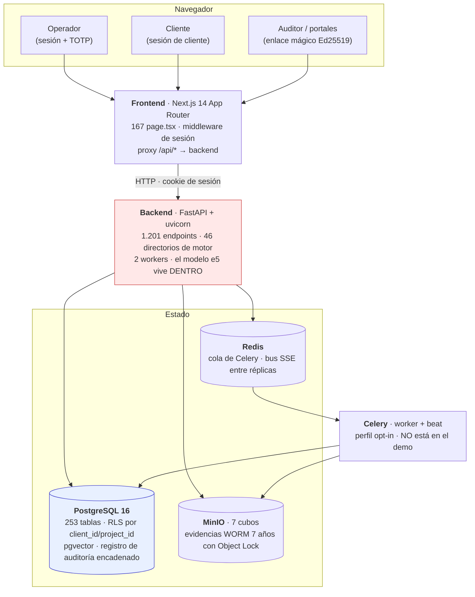

# Arquitectura de FULKRO

Una página. Qué piezas hay, dónde están los límites entre ellas, y qué decisión
justifica cada una. Para el detalle de una decisión concreta, el enlace lleva a
su ADR; el índice completo está en [`docs/adr/README.md`](docs/adr/README.md).

**Las cifras de esta página están medidas contra el sistema en pie el
2026-09-11**, con el comando que las saca al lado. Si alguna no cuadra al
repetirla, la que manda es la del comando.

---

## El sistema



Lo pintado en rojo es donde está la restricción de escala. Lo explica
[ADR-060](docs/adr/ADR-060-el-modelo-en-el-proceso-limita-los-workers.md) y se
resume abajo.

```
$ curl -s http://127.0.0.1:18000/openapi.json | python3 -c "import json,sys;d=json.load(sys.stdin);print(len(d['paths']),'rutas')"
$ find frontend/app -name page.tsx | wc -l
$ docker compose -f docker-compose.demo.yml exec -T postgres \
    psql -U fulkro -d fulkro -tAc "select count(*) from information_schema.tables where table_schema='public'"
```

---

## Los límites, uno por uno

### Navegador → frontend

Tres personas, tres formas de entrar, y el reparto lo hace `frontend/middleware.ts`
**antes** de que la petición llegue a ninguna página:

| persona | credencial | dónde vive |
|---|---|---|
| operador | sesión + segundo factor TOTP (WebAuthn en producción) | `/admin/*` |
| cliente | sesión de usuario de cliente | `/client-portal/*` |
| auditor y portales | enlace mágico firmado con Ed25519, sin cuenta | `/auditor-portal/*`, `/download/*`, … |

El middleware **no devuelve 403 a quien se equivoca de portal**: lo redirige al
suyo. Es una decisión de producto, no un descuido, y conviene saberla antes de
escribir una prueba que espere un 403.

Los enlaces mágicos son la única forma de entrar sin cuenta permanente
(regla R5). No dan sesión: cada petición revalida el token.

### Frontend → backend

El navegador **nunca habla directamente con el backend**. Next.js reescribe
`/api/*` contra el backend, así que para el navegador todo es el mismo origen.
Eso no es cosmético: las cookies son `SameSite` y de host, y un origen distinto
las dejaría fuera.

**Contrapartida**: el reverso de esa comodidad es que el frontend es un salto
más que puede caerse, y que la URL del backend se resuelve **en tiempo de
ejecución**, no al construir la imagen. Eso último fue un fallo real: el proxy
tenía `localhost` horneado en el build y el navegador no llegaba al backend
desde ninguna máquina que no fuera la del autor.

### Backend → PostgreSQL

Una sola base, y **el aislamiento entre clientes lo hace la base, no el código**:
RLS activo en toda tabla con `client_id` o `project_id`. Cuatro roles, y la
diferencia importa:

| rol | para qué | superusuario |
|---|---|---|
| `fulkro` | migraciones y siembra | sí |
| `fulkro_migrate` | Alembic en producción | sí |
| `fulkro_app` | **la aplicación en marcha** | no · RLS le aplica |
| `fulkro_app_bypassrls` | siembra y tareas que cruzan clientes | no · pero salta RLS |

Que la aplicación corra como `fulkro_app` NOSUPERUSER es lo que convierte el
aislamiento en una garantía y no en una convención: un `SELECT` sin filtro no
puede ver el proyecto de otro cliente aunque alguien olvide el `WHERE`.

Encima de eso hay dos cosas que no son negociables (reglas R6 y R7):

- **Registro de auditoría inmutable**, encadenado por hash SHA-256 con un
  disparador PL/pgSQL, y con `pg_advisory_xact_lock` para que dos escrituras
  concurrentes no rompan la cadena. Hay disparadores que prohíben `UPDATE` y
  `DELETE` sobre esa tabla.
- **La búsqueda del corpus vive aquí**, en `pgvector`: 1.031 fragmentos de
  normativa con sus vectores de 1.024 dimensiones.

**Contrapartida, dicha en voz alta**: esto escala la capa de aplicación, no la de
datos. La base es **una**, y su techo no se ha medido
([ADR-058](docs/adr/ADR-058-escalabilidad-horizontal.md)).

### Backend → Redis

Dos usos que no se parecen:

1. **Cola de Celery** para lo que no puede hacerse dentro de una petición.
2. **Bus del tiempo real**: los eventos SSE se publican en Redis para que
   lleguen a un navegador conectado a *otra* réplica. Antes era un diccionario
   en la memoria del proceso, y con dos réplicas eso significaba que la mitad de
   los avisos no llegaban. Lo arregló y lo midió
   [ADR-058](docs/adr/ADR-058-escalabilidad-horizontal.md).

**Sin Redis no hay tiempo real entre réplicas.** Con una sola réplica el sistema
funciona igual, así que es fácil no enterarse hasta que se despliegan dos.

### Backend → MinIO

Siete cubos. El que manda es `fulkro-evidence-worm`, creado **con Object Lock**:
las evidencias de una auditoría ENS no se pueden borrar ni reescribir durante
siete años, ni por un administrador. Es un requisito de trazabilidad ante ENAC
implementado en el almacenamiento, no en la aplicación.

**Contrapartida**: lo que se sube ahí por error se queda ahí siete años.

### Celery, y una advertencia

El worker y el `beat` están en `docker-compose.yml` bajo el perfil `workers`, que
es **opt-in**. El perfil demo (`docker-compose.demo.yml`) **no los levanta**, y
está escrito en su cabecera. Todo lo que dependa de una tarea programada —avisos,
comprobaciones periódicas, la cola de reintentos— **no ocurre en el demo**.

---

## Dónde está el techo, y por qué está ahí

Esto es lo único de esta página que no es descripción, sino resultado de una
medida.

Con la rampa de carga de `make carga` sobre el demo (14 núcleos):

| | 1 réplica | 2 réplicas |
|---|---|---|
| endpoints de base de datos (c=40) | 157–430 rps | ×1,7 a ×2,4 |
| `/corpus/search` (c=1) | 7,2 rps · p50 54 ms | **se cae: 30 s y error** |
| CPU del backend, endpoints de base | ~200 % | — |
| CPU del backend, `/corpus/search` | **1.324 %** | — |

Las tres cifras juntas dicen una sola cosa:

> **El número de procesos de backend no lo limita la CPU. Lo limita la memoria
> del modelo de embeddings**, porque cada worker de uvicorn carga su propia copia
> de e5-large (~1,4 GB) y abre su propio grupo de hilos de ONNX.

De ahí sale la asimetría que se ve en la tabla: un endpoint de base de datos es
espera de E/S y se reparte bien; una búsqueda del corpus es aritmética densa y un
solo proceso ya quiere los catorce núcleos. **No hay un número de workers bueno
para las dos cosas mientras vivan en el mismo proceso.**

Las tres salidas —servicio de embeddings aparte, cola con un único trabajador, o
endpoint externo— están razonadas con sus contrapartidas en
[ADR-060](docs/adr/ADR-060-el-modelo-en-el-proceso-limita-los-workers.md).
Ninguna está implementada.

---

## Las decisiones que sostienen todo esto

| decisión | qué zanja |
|---|---|
| [ADR-056](docs/adr/ADR-056-postgres-demo-sin-age.md) | El Postgres del demo no compila Apache AGE ni pgAudit |
| [ADR-057](docs/adr/ADR-057-imagen-backend-sin-instrumental-pentest.md) | La imagen del backend se parte: aplicación (2,79 GB) e instrumental de pentest |
| [ADR-058](docs/adr/ADR-058-escalabilidad-horizontal.md) | ¿Escala en horizontal? Medido con dos réplicas · **corrección**, no rendimiento |
| [ADR-059](docs/adr/ADR-059-llamada-llm-fallida-no-es-exito.md) | Una llamada al modelo que falla no se registra como éxito |
| [ADR-060](docs/adr/ADR-060-el-modelo-en-el-proceso-limita-los-workers.md) | El modelo en el proceso limita los workers · las tres salidas |
| ADR-013 (`docs/spec/DECISIONS.md`) | Separación arquitectónica de portales: admin y cliente con pools de autenticación y routers distintos |
| ADR-030 (`docs/spec/DECISIONS.md`) | Autenticación global por dependencia + lista blanca justificada (es la puerta por la que pasa `/metrics`) |

> **Aviso sobre esta tabla.** Sólo lleva ADR cuyo título se ha comprobado en su
> fuente. Comprobándolos aparecieron dos discrepancias que **no se arreglan
> aquí** porque no consta cuál de las dos versiones es la buena: `CLAUDE.md`
> resume ADR-014 como «OAuth de sólo lectura» y ADR-025 como «no crear tabla
> nueva si una existente cubre el caso», pero en `docs/spec/DECISIONS.md` el
> ADR-014 es «Portal ENS Radar admin-only» (de un subsistema **retirado** en
> 2026-06-07) y el ADR-025 es «DB drift resolution». Las dos decisiones que
> describe `CLAUDE.md` son reales y están vigentes; lo que no cuadra es el
> número. Queda anotado en [`docs/adr/README.md`](docs/adr/README.md).

---

## Lo que esta página NO dice

- **No es un mapa de los 46 motores.** Para eso está `CLAUDE.md` y el README de
  cada motor. Aquí sólo están los límites entre procesos.
- **No describe el despliegue en producción.** El objetivo es Hetzner y el
  runbook vive en [`docs/deploy/`](docs/deploy/). Todo lo medido aquí es Docker
  Compose en una máquina.
- **No hay cifra de disponibilidad, ni de recuperación ante desastre, ni de
  copias probadas.** La regla R8 pide una prueba mensual de restauración; que la
  regla exista no es lo mismo que haberla ejecutado, y aquí no consta ninguna.

## Los comandos que lo enseñan funcionando

```
make demo             # levanta la pila entera y la deja poblada
make smoke            # comprueba que lo que dice USAGE.md es cierto
make recorrer-todo    # abre las 167 páginas y mide si FUNCIONAN, no si cargan
make eval-recuperacion  # mide si el buscador del corpus recupera lo que debe
make carga            # rampa de carga: 1 réplica y luego 2, con la CPU al lado
```
