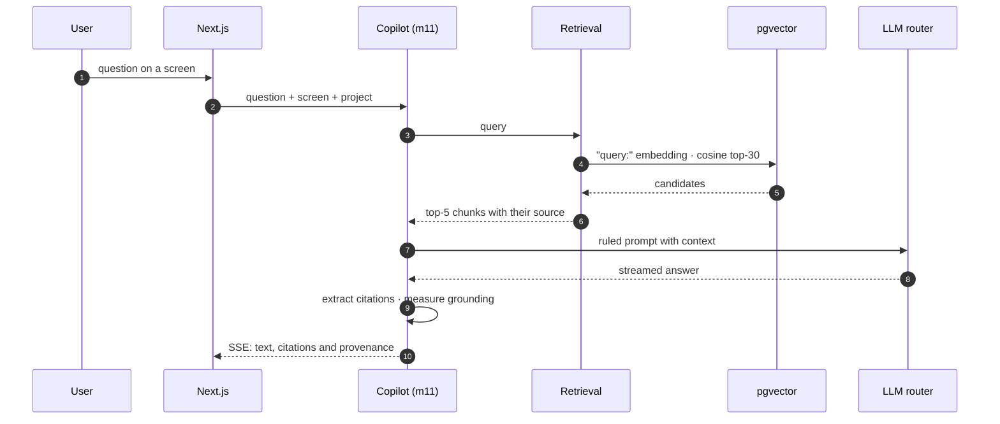

<div align="center">



<br><br>

[](LICENSE)
[](backend/pyproject.toml)
[](#metrics)
[](#the-four-portals)
[](#architecture)
[](#evals-and-quality)

[Español](README.md) · **English**

</div>

<br>

Fulkro is a platform for implementing Spain's **National Security Framework** (ENS, Royal Decree
311/2022), which every company providing services to the Spanish public sector must comply with.
It covers the whole lifecycle, from categorising the system to the declaration of conformity handed
to the certification body, and splits it across four portals: the consultant's, the client's, the
auditor's and public verification. It was built and run by one person. The project was paused in
September 2026 for lack of commercial traction, and the full code is published under Apache-2.0: it
starts with one command, with demo data already loaded. The interface is in Spanish.

<div align="center">

<br><sub>Real walkthrough on the demo (<code>make demo</code>): admin, client and auditor. The data is fictitious.</sub>
</div>

## In one minute

- **What it solves.** The ENS requires public-sector suppliers to categorise their system, analyse
  risk with MAGERIT (the Spanish risk methodology), justify which of the 73 measures in Annex II
  apply, implement them with evidence and pass an audit. Fulkro turns that process into a workflow
  with gates between phases, generated documents and verifiable evidence.
- **How it decides.** 44 domain engines on FastAPI. Every regulatory decision (the category, which
  measures apply, the deadlines) is computed by a deterministic, traceable engine, never by a
  language model.
- **Where AI comes in.** 12 agents with structured output and a RAG copilot over the regulatory
  corpus. The model drafts; every text records whether it came from the model or from a fallback
  template, and the interface shows it.
- **Why it can be trusted.** Per-client isolation with row-level security on 185 tables, an
  immutable hash-chained audit log, Ed25519 signatures on documents and evidence, and WORM storage.
- **How we know it works.** 6,895 passing tests, 413 end-to-end scenarios, 97 pages audited with axe
  (WCAG) and a retrieval evaluation with confidence intervals that decided the RAG architecture.

<table>
<tr>
<td align="center" width="25%"><h3>44</h3><sub>domain engines</sub></td>
<td align="center" width="25%"><h3>1,203</h3><sub>API operations</sub></td>
<td align="center" width="25%"><h3>12</h3><sub>active AI agents</sub></td>
<td align="center" width="25%"><h3>123</h3><sub>document templates</sub></td>
</tr>
<tr>
<td align="center"><h3>0.959</h3><sub>RAG hit@5</sub></td>
<td align="center"><h3>185</h3><sub>tables with RLS</sub></td>
<td align="center"><h3>6,895</h3><sub>passing tests</sub></td>
<td align="center"><h3>97</h3><sub>WCAG pages with no serious issues</sub></td>
</tr>
</table>

<details>
<summary><b>Contents</b></summary>

- [What Fulkro does](#what-fulkro-does)
- [Architecture](#architecture)
- [The ENS lifecycle](#the-ens-lifecycle)
- [The four portals](#the-four-portals)
- [The AI layer](#the-ai-layer)
- [RAG: regulatory retrieval](#rag-regulatory-retrieval)
- [Evals and quality](#evals-and-quality)
- [Security and trust](#security-and-trust)
- [Architecture decisions](#architecture-decisions)
- [Try it](#try-it)
- [Metrics](#metrics)
- [Data, licences and layout](#data-licences-and-layout)

</details>

---

## What Fulkro does

<table>
<tr>
<td width="33%" valign="top"><b>The full ENS lifecycle</b><br><sub>Categorisation across the five dimensions of Annex I, MAGERIT v3 risk analysis, statement of applicability for the 73 measures, remediation plan with a Gantt chart, implementation, audit rehearsal and declaration of conformity.</sub></td>
<td width="33%" valign="top"><b>Deterministic engines</b><br><sub>Each regulatory rule lives in exactly one engine, with tests that stop it from being duplicated. The two applicability axes of Annex II (category and per-dimension level) are extracted from the Official Gazette and verified against it.</sub></td>
<td width="33%" valign="top"><b>AI layer</b><br><sub>12 agents (diagnosis, contracts, proposals, virtual internal auditor, document classification…) and a copilot that explains every screen and cites RD 311/2022, with streamed answers.</sub></td>
</tr>
<tr>
<td valign="top"><b>Regulatory RAG</b><br><sub>1,031 chunks of RD 311/2022 and EU law (GDPR, DORA, NIS2, eIDAS), 1024-dimension e5-large embeddings in pgvector, and a retrieval architecture chosen by evaluation.</sub></td>
<td valign="top"><b>Document factory</b><br><sub>123 templates (35 policies, 36 procedures, 41 deliverables, registers) filled with project data and rendered to DOCX and PDF, versioned and signable.</sub></td>
<td valign="top"><b>Evidence with chain of custody</b><br><sub>Every piece of evidence is virus-scanned, sealed with SHA-256 and an Ed25519 signature, and stored in a WORM bucket with 7-year retention. The auditor sees coverage measured against it.</sub></td>
</tr>
<tr>
<td valign="top"><b>Electronic signature</b><br><sub>Canvas signature (eIDAS art. 25.1) with an Ed25519 seal and a per-document hash chain, OTP verification, and the signature embedded in the last page of the PDF.</sub></td>
<td valign="top"><b>Cloud and technical verification</b><br><sub>Read-only connectors for Microsoft 365 and Google Workspace that detect gaps, and 13 MCP verification servers (cloud, network, web, SAST…) behind a scope enforcer.</sub></td>
<td valign="top"><b>Operations and self-compliance</b><br><sub>Cost observability for every model call, a compliance monitor that applies ENS Medium to the platform itself, encrypted backups and 20 scheduled jobs.</sub></td>
</tr>
</table>

---

## Architecture

<div align="center">

</div>

**Principles behind the shape:**

1. **A regulatory rule lives in exactly one engine.** When the same rule existed in two places, it
   drifted. `backend/tests/audit_fixes/test_operaciones_normativas_un_solo_camino.py` prevents it.
2. **Engines decide, the model drafts.** Signable documents are produced by an engine: the
   statement of applicability's justification comes from a deterministic template, and anything an
   agent proposes is reviewed by the consultant.
3. **One door.** `authenticate_request` is a global dependency: all 1,204 routes go through it, and
   then each router requires its subject population (admin or client).
4. **Isolation in the database, not in the application.** The process runs as a non-superuser role
   and every request sets its client context; RLS policies do the rest.
5. **Stateless across replicas.** Sessions, signing keys and files live outside the process;
   measured with two replicas behind nginx ([ADR-058](docs/adr/ADR-058-escalabilidad-horizontal.md)).

| layer | technology |
|---|---|
| Frontend | Next.js 15 (App Router), React, TypeScript, Tailwind, shadcn/ui, TanStack Query, Zustand |
| API | Python 3.12, FastAPI, async SQLAlchemy 2, Pydantic, Alembic (273 migrations) |
| Data | PostgreSQL 16 with pgvector (HNSW) and RLS, MinIO with Object Lock, Redis |
| Async work | Celery with 20 scheduled jobs, SSE fan-out with `Last-Event-ID` replay |
| AI | Official Anthropic SDK behind an in-house router, FastEmbed with `multilingual-e5-large` |
| Documents | docxtpl, headless LibreOffice, ReportLab, Ed25519 signing |
| Quality | pytest, Playwright, axe-core, ruff, mypy, bandit, safety, npm audit |
| Deployment | Docker Compose (demo and production), Caddy, image published to GHCR |

---

## The ENS lifecycle

<div align="center">

</div>

The ENS is not a checklist: it is a lifecycle with dependencies. Each phase consumes what the
previous one produced, and the gates between phases live in the code.

| # | phase | engine | produces | gate to the next one |
|---|---|---|---|---|
| 1 | **Categorisation** | m01 | signed record **E-012** | no approved category, no statement of applicability |
| 2 | **Risk analysis** | m02 | report **E-028** (MAGERIT v3) | one current analysis, guaranteed by the database |
| 3 | **Statement of applicability** | m03 | 73 Annex II entries | freezing it requires 80% assessed and the security officer's signature |
| 4 | **Remediation plan** | m17 | **E-150** with milestones and dependencies | derived from the gap analysis |
| 5 | **Implementation** | m07 | evidence in WORM storage | every measure backed by current evidence |
| 6 | **Verification** | m10 · m09 | signed pre-audit rehearsal | coverage measured, not declared |
| 7 | **Conformity** | m27 · m09 | auditor dossier and declaration **E-041** | the declaration states what was verified |

**Applying the regulation precisely.** The category is the **maximum** of the five dimensions
(confidentiality, integrity, availability, authenticity and traceability) assessed on the system's
services and information. A dimension nobody assessed is not assigned any level, as Annex I says
([ADR-061](docs/adr/ADR-061-el-eje-de-dimensiones-y-la-dimension-no-afectada.md)). A measure applies
by the system's **category** or by the **level of a dimension**, the two axes of Annex II: 45
measures by the first and 28 by the second. Applicable by category: **BASIC 52 · MEDIUM 68 · HIGH 73**.

---

## The four portals

<table>
<tr>
<td width="50%"></td>
<td width="50%"></td>
</tr>
<tr>
<td align="center"><b>Admin · command centre</b><br><sub>every project's status at once</sub></td>
<td align="center"><b>Admin · statement of applicability</b><br><sub>the 73 Annex II measures, with both axes</sub></td>
</tr>
<tr>
<td width="50%"></td>
<td width="50%"></td>
</tr>
<tr>
<td align="center"><b>Client · home</b><br><sub>progress, tasks and documents, no jargon</sub></td>
<td align="center"><b>Client · signatures</b><br><sub>each signature cryptographically chained to the previous one</sub></td>
</tr>
<tr>
<td width="50%"></td>
<td width="50%"></td>
</tr>
<tr>
<td align="center"><b>Auditor · coverage</b><br><sub>declared measures against current evidence</sub></td>
<td align="center"><b>Auditor · immutable log</b><br><sub>verifiable hash chain</sub></td>
</tr>
</table>

| portal | who | how they get in | what it does |
|---|---|---|---|
| **Admin** | the consultant | password plus WebAuthn or TOTP | 95 pages, nearly all under `/admin/projects/{id}/…`: 46 tabs per project ordered by the lifecycle, a command centre across all clients and a copilot that explains every screen |
| **Client** | the company being certified | email, password and optional MFA | 41 pages to **review, approve, sign and receive**: progress, tasks, plan, documents, signatures, certification and chat with the consultant, in a tone enforced by tests |
| **Auditor** | the certification body | Ed25519-signed link and one-time code, no account | read-only dossier: statement of applicability, MAGERIT, plan, evidence, audit log, coverage map, annotations and clarification requests that reach the consultant in real time |
| **Public** | anyone with a link | signed link | document download, pre-sales diagnostic questionnaire, third-party signing and Ed25519 signature verification against the system's public key |

There is also a scoped portal for the **external penetration tester**, entered through a signed
link.

---

## The AI layer

<div align="center">

</div>

**The agents.** Twelve are active in the registry (`backend/app/agents/registry.py`), each tied to
the engine that consumes it:

| agent | engine | tier | what it does |
|---|---|---|---|
| A4 · Diagnosis writer | m22 | Sonnet | drafts the narrative sections of the E-090 diagnosis; the engine computes the data |
| A6 · Contract analyst | m14 | Sonnet | reviews the client's contracts with its suppliers and finds ENS and GDPR gaps |
| A11 · Virtual internal auditor | m10 | Opus | adds senior-auditor judgement on top of the deterministic 58-question rehearsal |
| A12 · Client coach | m09 | Sonnet | assesses the client's answers to the auditor's questions |
| A14 · Copilot | m11 | Sonnet | talks about the current screen, with RAG and citations |
| A17 · Sales qualifier | m13 | Sonnet | scores an opportunity after the first contact |
| A18 · Discovery meeting | m13 | Sonnet | recomputes the meeting's conclusions live from the notes |
| A19 · Proposal writer | m13 | Opus | drafts proposal P-001 on top of the price the engine computes |
| A20 · Contract negotiator | m14 | Sonnet | turns the approved proposal into draft contract C-001 |
| A21 · Discrepancy detector | m04 | deterministic | cross-checks what was declared against what was verified |
| A27 · Document classifier | m24 | Haiku | classifies documents the deterministic heuristic cannot place |
| A31 · Applicability enricher | m03 | Sonnet | proposes a client-specific justification for the measures that do not apply |

**Structured output and provenance.** Eleven of the twelve request structured output: JSON bound to
a schema, validated and retried three times before a fallback template is served. Every result
carries the `generado_por` key with three possible values (`backend/app/agents/procedencia.py`):

| `generado_por` | meaning |
|---|---|
| `modelo` | written by the model and schema-valid |
| `plantilla_por_fallo_de_esquema` | the model answered, but its output did not match the schema |
| `sin_clave_de_api` | no `ANTHROPIC_API_KEY`: no model was called |

The flag travels all the way to the screen, so the platform starts and works without an API key
and never presents a template as model-written text.

**The LLM router** (`backend/app/core/ai/llm_router.py`) is the single door to the model:

- **429 retries**, three, with exponential backoff of 2, 8 and 32 seconds; if the requested model is
  still saturated or returns a 5xx, it retries with the fallback model. Auth errors and malformed
  requests are not retried.
- **Prompt caching**: the system prompt is sent with ephemeral `cache_control`, so calls that repeat
  it read it from Anthropic's cache.
- **Model catalogue**: it knows which models accept `temperature` and always sets it to 0.2 or less.
- **Every call logged** with model, tokens and cost in `llm_interaction_log`, per-surface caps, and a
  failed call is never recorded as a success
  ([ADR-059](docs/adr/ADR-059-llamada-llm-fallida-no-es-exito.md)).

**Guardrails.** Mandatory regulatory citations in every answer, a prompt-injection guard
(`backend/app/security/llm_prompt_injection_guard.py`), a tone filter on everything the client sees,
and a "not in the corpus" mode when an answer cannot be grounded.

---

## RAG: regulatory retrieval

<div align="center">

</div>

**Ingestion.** A deterministic parser splits the consolidated HTML from the Official Gazette along
its real structure (preamble, 41 articles, provisions and the four annexes, with the exact 73
measure codes) plus the official EU texts. That yields 1,031 chunks: 127 from RD 311/2022 and 904
from GDPR, DORA, NIS2 and eIDAS. Each is embedded with `intfloat/multilingual-e5-large` (1024
dimensions, `passage:` prefix) and indexed in pgvector with HNSW over cosine (`m=16`,
`ef_construction=64`).

**Retrieval.** The question, with the current screen and project state as context, is embedded with
the `query:` prefix; pgvector returns 30 candidates by cosine and the best 5 are kept
(`backend/app/corpus/retrieval.py`).

**Generation and validation.** The copilot answers at low temperature and must cite every claim in
brackets. Then the citations are extracted, at least 30% of the answer must be supported by the
retrieved chunks, and a "not in the corpus" answer is detected. The answer streams over SSE, with
citations as they appear.



**Evaluation: a measurement chose the architecture.** 49 hand-labelled compliance queries, all
five branches measured on the same queries, with bootstrap intervals from 1,000 resamples:

| branch | hit@5 | recall@5 | MRR |
|---|---:|---:|---:|
| **vector only** | **0.959** | **0.824** | **0.752** |
| RRF fusion (vector + lexical) | 0.857 | 0.667 | 0.627 |

| paired contrast | difference | 95% CI |
|---|---:|---|
| vector − fusion · hit@5 | +0.102 | [+0.020, +0.204] |
| vector − fusion · recall@5 | +0.157 | [+0.065, +0.255] |
| vector − fusion · MRR | +0.125 | [+0.013, +0.246] |

All three intervals exclude zero. The lexical branch contributed none of the 96 relevant chunks the
vector search had not already found in its top 30, and sweeping its weight in the fusion from 0 to 1
gives a curve that peaks at no fusion. That is why production retrieval is vector-only, and the
harness still measures all five branches so the question can be answered again if the corpus
changes:

```bash
make eval-recuperacion     # writes out/eval_recuperacion.json
```

Full methodology (in Spanish) in [`docs/EVAL_RECUPERACION.md`](docs/EVAL_RECUPERACION.md).

---

## Evals and quality

| what is measured | result | where |
|---|---|---|
| Backend suite | **6,895 pass · 0 fail** (3,573 without a database + 3,322 with one) | `pytest`, and `pytest-completo.yml` on GitHub |
| End-to-end scenarios | **413 / 413** | Playwright against the real application |
| Accessibility | **97 / 97** pages with no critical or serious issues | axe-core on the three portals, on every push |
| RAG retrieval | hit@5 **0.959** · recall@5 **0.824** · MRR **0.752** | `make eval-recuperacion` |
| Agents against the real model | **22 / 22** end to end, one per agent and engine | opt-in tests with `ANTHROPIC_API_KEY` |
| Agent golden sets | 4 sets, 40 entries, validated on every PR | `evals.yml` · job `evals-arnes` |
| Load | reads at **200-450 req/s** per replica, **1.7-1.9×** with two | [`docs/PRUEBA_DE_CARGA.md`](docs/PRUEBA_DE_CARGA.md) |
| Demo | **22 / 22** checks against real data | `make smoke` |

**Continuous integration**, six workflows:

| workflow | what it checks |
|---|---|
| `ci.yml` | ruff, mypy, frontend types, the database-free suite and the eval harness |
| `pytest-completo.yml` | the database suite, in four shards, against seeded PostgreSQL and MinIO |
| `admin-polish-empirical.yml` | axe (WCAG 2.2 AA) over 97 admin, client and auditor pages |
| `evals.yml` | the golden sets, and running them against the model when a key is present |
| `security-scan.yml` | bandit, safety and npm audit |
| `publish-image.yml` | builds and publishes the image to GHCR |

**Guards that protect the repository on every PR:** the README's figures reproduce with their
commands, no writing `fetch` goes without a CSRF token, every UI link emitted by the backend leads
to a real page, every reference to a repository path exists, no regulatory rule is duplicated, and
the ENS catalogue does not repeat third-party text (checked against a SHA-256 fingerprint, without
storing the text).

---

## Security and trust

<div align="center">

</div>

- **Identity.** The consultant signs in with a password plus WebAuthn (hardware key) or TOTP; the
  client with its own MFA; the auditor and external signers with Ed25519-signed links that expire and
  ask for a one-time code. There are 37 distinct link purposes, each with its own policy.
- **Session.** An Ed25519-signed JWT in an `httpOnly` cookie, with triple-bound CSRF verification on
  every writing request.
- **Isolation.** RLS on 185 of the 253 tables, 192 policies, and a non-superuser application role: a
  query without a client context sees nothing.
- **Integrity.** The audit log chains every row with SHA-256 through a PostgreSQL trigger, and two
  more triggers forbid `UPDATE` and `DELETE`. The chain can be verified from the auditor portal.
- **Custody.** Antivirus, SHA-256 and an Ed25519 signature on every piece of evidence, and a MinIO
  bucket with Object Lock in COMPLIANCE mode for 7 years.
- **Operations.** Fernet-encrypted backups, a monitor that applies ENS Medium to the platform itself,
  and built-in handling of GDPR rights requests and breaches.

---

## Architecture decisions

| decision | why | where |
|---|---|---|
| Deterministic engines for every regulatory decision | a regulatory decision must be reproducible and explainable to an auditor | `backend/app/motors/` |
| One regulatory rule, one engine | two copies of a rule end up drifting apart | `test_operaciones_normativas_un_solo_camino.py` |
| Explicit provenance of generated text | nobody should mistake a template for model-written text | [ADR-059](docs/adr/ADR-059-llamada-llm-fallida-no-es-exito.md) |
| Vector-only retrieval | measured against fusion: it wins on all three metrics | [`EVAL_RECUPERACION.md`](docs/EVAL_RECUPERACION.md) |
| Isolation through PostgreSQL RLS | isolation does not depend on every query remembering to filter | `infra/docker/init-roles.sql` |
| One operator, many clients | a simple identity model in exchange for regulatory depth | `backend/app/auth/dependencies.py` |
| Project-scoped admin | the consultant works one client at a time, with persistent context | [ADR-054](docs/architecture/ADR-054_project_scoped_admin_ux.md) |
| Read-only cloud connectors | detect gaps without being able to break anything in the client's account | [ADR-053](docs/architecture/ADR-053_cloud_first_architecture.md) |
| Risk-tiered remediation | harmless fixes are automated; risky ones require authorisation | [ADR-055](docs/architecture/ADR-055-auto-remediation.md) |
| Stateless processes | scaling means adding replicas; measured with two | [ADR-058](docs/adr/ADR-058-escalabilidad-horizontal.md) |
| Workers sized by the embedding model's memory | the real limit is the model's RAM, not the CPU | [ADR-060](docs/adr/ADR-060-el-modelo-en-el-proceso-limita-los-workers.md) |
| Backend image split in two | the application does not carry the penetration-testing toolkit | [ADR-057](docs/adr/ADR-057-imagen-backend-sin-instrumental-pentest.md) |

The full index (in Spanish) is in [`docs/adr/README.md`](docs/adr/README.md) and the component map
in [`ARCHITECTURE.md`](ARCHITECTURE.md).

---

## Try it

One command, no API key needed:

```bash
git clone https://github.com/Fulkrodev/Fulkrosys.git
cd Fulkrosys
make demo
```

It leaves the application at `http://localhost:3000` with data loaded (73 Annex II measures, 73
statement-of-applicability entries, 209 pieces of evidence, 35 plan tasks, 21 documents and 1,031
corpus chunks) and prints the credentials for the three portals, including the second-factor code
and the auditor's signed link.

```bash
make smoke     # really signs in to the three portals and checks the data
make down      # stops, keeping the database
make clean     # also removes the volumes
```

Requirements, measured timings and common issues are in [`INSTALL.md`](INSTALL.md); a guided tour of
the screens is in [`USAGE.md`](USAGE.md) (both in Spanish).

The walkthrough at the top is regenerated on the demo with
`frontend/tests/capturas/grabar-recorrido.mjs` and `scripts/recorrido_a_gif.sh`, and the diagrams
with `scripts/generar_diagramas_readme.py`.

---

## Metrics

Every figure comes with the command that reproduces it, and
`backend/tests/test_las_cifras_del_readme_reproducen.py` checks on every PR that they still match.

| | | command |
|---|---:|---|
| API operations | **1,203** across 1,100 paths | `app.openapi()` · below |
| Domain engines | **44** | `ls -d backend/app/motors/m*/ \| wc -l` |
| PostgreSQL tables | **253** | `psql -c "\\dt" \| wc -l` |
| Alembic migrations | **273** | `ls backend/migrations/versions/*.py \| wc -l` |
| Frontend pages | **167** | `find frontend/app -name page.tsx \| wc -l` |
| React components | **424** | `find frontend/components -name '*.tsx' \| wc -l` |
| Lines of Python | **244,277** | `find backend/app -name '*.py' \| xargs wc -l` |
| Test files | **640** | `find backend/tests -name 'test_*.py' \| wc -l` |
| Playwright specs | **300** | `find frontend/tests -name '*.spec.ts' \| wc -l` |

<details>
<summary><b>The figures, each with its command</b></summary>

```bash
$ git ls-files backend/app | grep '\.py$' | xargs wc -l | tail -1
 244277 total

$ ls -d backend/app/motors/m*/ | wc -l
44

$ ls backend/migrations/versions/*.py | wc -l
273

# with the backend environment: the API surface is its OpenAPI schema
$ python3 -c "from backend.app.main import app; e=app.openapi(); \
M={'get','post','put','patch','delete','head','options','trace'}; \
print(len(e['paths']),'paths ·', sum(1 for v in e['paths'].values() for m in v if m in M),'operations')"
1100 paths · 1203 operations

$ ls backend/app/agents | grep -oE '^agent_[0-9]+' | sort -u | wc -l
13
$ python -c "from backend.app.agents.registry import AGENT_REGISTRY as R; print(sum(v['status'] == 'activo' for v in R.values()))"
12
$ grep -n '^_RATE_LIMIT_BACKOFFS' backend/app/core/ai/llm_router.py
107:_RATE_LIMIT_BACKOFFS: tuple[float, ...] = (2.0, 8.0, 32.0)
```

</details>

---

## Data, licences and layout

The **code** is under [Apache-2.0](LICENSE). The corpus shipped with the tests
(`backend/tests/fixtures/corpus_seed.sql.gz`) contains only freely redistributable sources: RD
311/2022 (Official Gazette text) and European Union law. The CCN and AEPD guides are not versioned:
the pipeline ingests them locally. The measure catalogue is written in original wording and every
measure keeps its reference to the official source.

| corpus source | what it is |
|---|---|
| `RD_311_2022` | official regulation, BOE-A-2022-7191 |
| `UE-RGPD`, `UE-DORA`, `UE-NIS2`, `UE-EIDAS` | official European Union law |
| `CCN-STIC-800…814` guides | CCN guides, downloaded by the operator |
| `FULKRO_RESUMEN_CONFORMIDAD_ENS` | in-house summary, labelled as such so retrieval tells it apart from the regulation |

Third parties credited: **shadcn/ui** (MIT), **MITRE ATT&CK** and **MAGERIT v3.0** (Spanish Ministry
of Finance and Public Administration).

```
backend/          FastAPI · 44 engine directories in app/motors/ · 273 migrations
frontend/         Next.js 15 · App Router · 5 route groups:
                  (admin) (client-portal) (legal) (portal) (public)
docs/             catalogues read at start-up (MAGERIT, ENS, templates), ADRs and evaluations
infra/docker/     init SQL for extensions, RLS functions and roles · Dockerfiles
scripts/          operations, measurement and generation of the diagrams and the walkthrough
landing/          the project's static site (fulkro.es)
```
