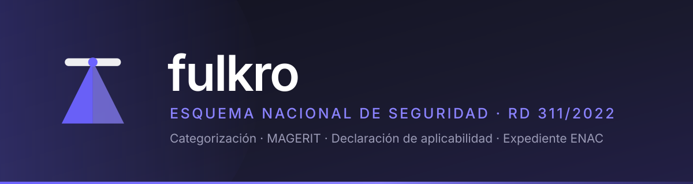
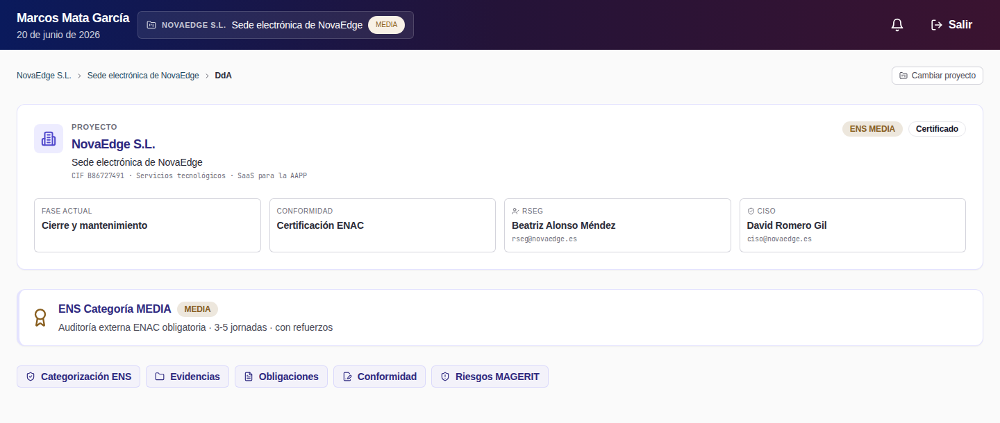
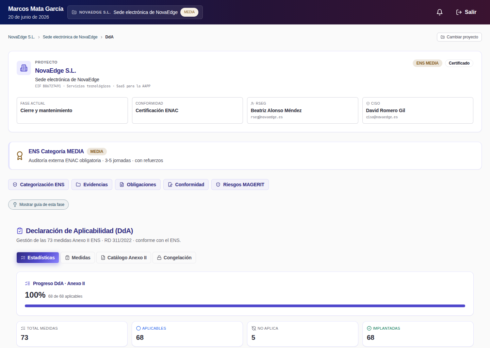
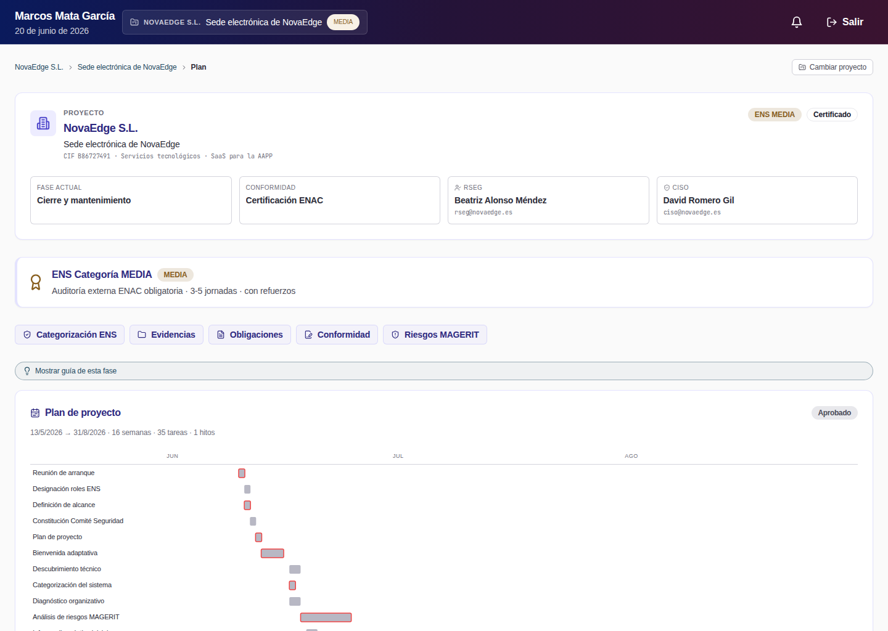
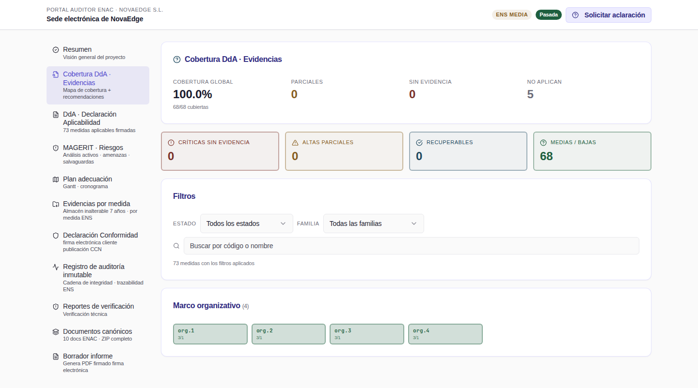
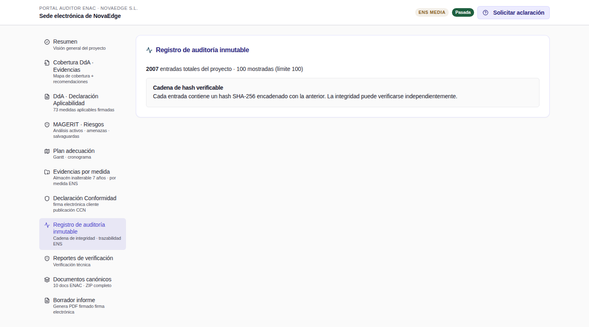
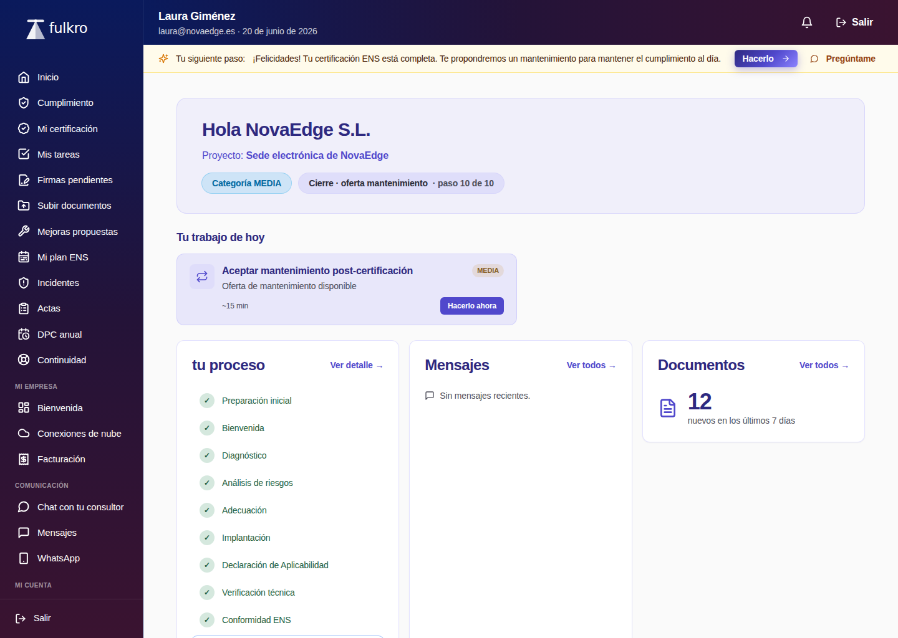
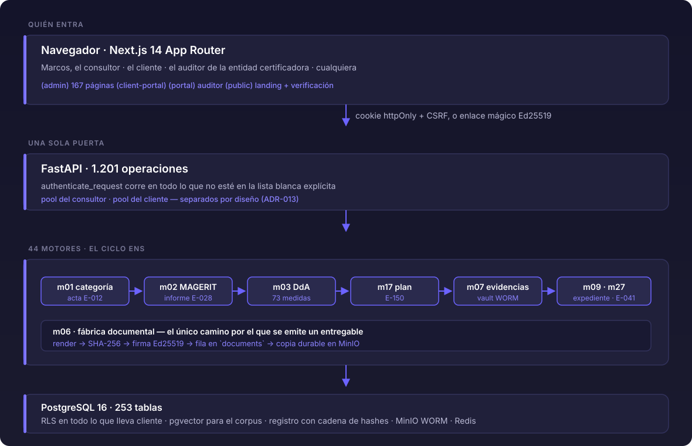

<div align="center">



<br>

[](LICENSE)
[](backend/pyproject.toml)
[](#métricas)
[](#los-cuatro-portales)
[](#cómo-está-construido)
[](#suite)

**Categorización · Análisis de riesgos MAGERIT · Declaración de aplicabilidad · Plan de adecuación
· Generación documental · Evidencias · Portal de auditor**

</div>

<br>

> Plataforma que implantaba el **Esquema Nacional de Seguridad** (RD 311/2022) de punta a punta,
> construida y operada por una sola persona. El proyecto cerró en septiembre de 2026 y el código
> se publica bajo Apache-2.0.

<table>
<tr>
<td width="25%" align="center"><b>44</b><br><sub>motores de dominio</sub></td>
<td width="25%" align="center"><b>73</b><br><sub>medidas del Anexo II</sub></td>
<td width="25%" align="center"><b>4</b><br><sub>portales</sub></td>
<td width="25%" align="center"><b>7</b><br><sub>fases del ciclo</sub></td>
</tr>
</table>

---

## Qué se ve

<table>
<tr>
<td width="50%"></td>
<td width="50%"></td>
</tr>
<tr>
<td align="center"><b>Centro de mando</b><br><sub>estado de todos los proyectos a la vez</sub></td>
<td align="center"><b>Declaración de aplicabilidad</b><br><sub>las 73 medidas del Anexo II, con sus dos ejes</sub></td>
</tr>
<tr>
<td width="50%"></td>
<td width="50%"></td>
</tr>
<tr>
<td align="center"><b>Plan de adecuación</b><br><sub>hitos, dependencias y responsables</sub></td>
<td align="center"><b>Portal de auditor</b><br><sub>cobertura medida contra evidencias, no declarada</sub></td>
</tr>
<tr>
<td width="50%"></td>
<td width="50%"></td>
</tr>
<tr>
<td align="center"><b>Registro inmutable</b><br><sub>cadena de hashes verificable</sub></td>
<td align="center"><b>Portal de cliente</b><br><sub>lo que el cliente ve y firma</sub></td>
</tr>
</table>

<sub>Quedan cuatro más en <a href="landing/assets/capturas/marketing/"><code>landing/assets/capturas/marketing/</code></a>:
<code>auditor-resumen</code>, <code>cliente-certificacion</code>, <code>cliente-firmas</code> y <code>cliente-remediaciones</code>.</sub>

---

## Para quién está construido, y para quién no

**Está construido para un operador único que lleva varios clientes en paralelo.** No para que una
empresa se registre y lo use.

No hay autorregistro. No existe un endpoint de alta:

```bash
$ git grep -nE '"/(signup|register|sign-up)"' -- backend/app
# sin salida
```

Solo hay dos poblaciones de sujeto, y están cableadas por nombre:

```bash
$ git grep -n "role_pool !=" -- backend/app/auth/dependencies.py
backend/app/auth/dependencies.py:71:    if subject.role_pool != "marcos":
backend/app/auth/dependencies.py:113:    if subject.role_pool != "cliente":
```

Y el reparto de las puertas de autorización enseña para quién se diseñó:

```bash
$ git grep -o 'Depends(require_owner)' -- backend/app | wc -l              # 249
$ git grep -o 'Depends(require_client_user)' -- backend/app | wc -l        #  31
$ git grep -o 'Depends(require_marcos_or_client)' -- backend/app | wc -l   #  24
```

**Esos tres comandos cuentan ocurrencias de un literal, no endpoints**, y una versión anterior de
este README saltó de lo uno a lo otro. El error no es el que parece: 132 de las 249 de
`require_owner` están a nivel de `APIRouter`, y **cada una protege todos los endpoints que cuelgan
de ese router**, que pueden ser uno o dieciséis. Es decir, el `grep` se queda **corto**, no largo.

Medido contra la aplicación en ejecución, recorriendo el árbol de dependencias de cada ruta de
forma recursiva (las puertas anidadas no salen en el primer nivel):

```bash
$ PYTHONPATH=. python3 scripts/medir_autorizacion.py
rutas resueltas          1201
operaciones (camino x metodo) 1201
contraste con el esquema OpenAPI: 1099 caminos, 1201 operaciones

puerta                         rutas   % rutas
require_owner                    845     70.4%
require_client_user               25      2.1%
require_marcos_or_client          81      6.7%

Corte por poblacion de sujeto (categorias EXCLUYENTES, suman el total):
solo administrador               849     70.7%
solo cliente                     176     14.7%
cualquiera de los dos             81      6.7%
ninguna de esas                   95      7.9%

De las 1106 rutas con puerta de poblacion, 849 exigen ser el administrador: 76.8%.
Rutas que pasan por `authenticate_request` (dependencia global): 1201/1201.
```

**Población contada: rutas.** En esta aplicación coinciden con las operaciones (camino × método),
porque cada ruta declara un solo método: 1.201 y 1.201, contrastado contra el esquema OpenAPI.

Las 845 reales frente a las 249 del `grep` dan la medida del desfase: contar el literal deja fuera
casi setecientos endpoints. Y hay un matiz que el conteo de tres puertas también se dejaba: hay
rutas que resuelven el sujeto con `get_current_user` o `get_current_client_user` sin pasar por
ninguna de las tres, así que «sin puerta» no significa «sin autenticación» — las 1.201 pasan por
`authenticate_request`.

**Con la población bien contada, la conclusión se sostiene: 76,8 % de las rutas con puerta de
población exigen ser el administrador**, casi ocho de cada diez. La frase era correcta; el comando
que la acompañaba, no. El script queda en el repositorio para que se pueda volver a medir.

**Consecuencia, dicha sin adornos:** un despacho de tres consultores no puede usar esto tal cual.
No hay bandeja de administración por usuario, ni roles intermedios, ni forma de repartir clientes
entre personas. Añadirlo no es configurar nada: es introducir un modelo de identidad que ahora
mismo no existe.

Es una decisión, no un descuido. Un solo operador significa que no hay que resolver permisos
entre iguales, ni conflictos de edición, ni jerarquías de visibilidad, y eso permitió llegar mucho
más lejos en la parte normativa. El coste es que el producto no escala a equipos sin rehacer la
capa de identidad. Se eligió a sabiendas.

---

---

## Cómo está construido

<div align="center">

</div>

**La forma tiene una razón.** Un motor es un paquete con su API, su servicio y sus
modelos, y una regla normativa vive en **un solo motor**. Cuando la misma regla
aparecía en dos, divergía — pasó con la regla del máximo del Anexo I (tres copias),
con el bienio del artículo 31 (cinco, ya divergentes en 720 vs 730 días) y con
«¿cuál es el análisis de riesgos vigente?» (ocho). Hay guardas que lo impiden en
`backend/tests/audit_fixes/test_operaciones_normativas_un_solo_camino.py`.

---

## Cómo funciona: el ciclo, fase por fase

El ENS no es una checklist: es un ciclo con dependencias. Cada fase consume lo que
produjo la anterior, y las puertas entre fases están en el código, no en la cabeza
del consultor.

| # | fase | motor | produce | puerta hacia la siguiente |
|---|---|---|---|---|
| 1 | **Categorización** | m01 | acta **E-012** firmada | sin categoría aprobada no hay DdA |
| 2 | **Análisis de riesgos** | m02 | informe **E-028** (MAGERIT v3) | el análisis vigente es uno, y lo fija la base |
| 3 | **Declaración de aplicabilidad** | m03 | 73 entradas del Anexo II | congelarla exige ≥80 % valorado y firma del RSEG |
| 4 | **Plan de adecuación** | m17 | **E-150** con hitos y dependencias | — |
| 5 | **Implantación** | m07 | evidencias en almacén WORM | — |
| 6 | **Verificación** | m10 · m09 | simulacro pre-ENAC firmado | — |
| 7 | **Salida** | m09 · m27 | expediente ENAC · declaración **E-041** | la declaración dice lo verificado, no lo declarado |

### 1 · Categorización

Cinco dimensiones —confidencialidad, integridad, disponibilidad, autenticidad,
trazabilidad— valoradas sobre los servicios y los tipos de información del sistema.
La categoría es el **máximo** de las dimensiones afectadas.

Una dimensión que nadie valora **no se adscribe a ningún nivel**; es lo que dice el
Anexo I punto 3, y tiene consecuencias: un sistema sin ninguna dimensión valorada no
es BÁSICA, es un sistema sin categorizar. El acta E-012 lo imprime como «No afectada»
y el sistema no la rellena con un nivel inventado.

### 2 · Análisis de riesgos

MAGERIT v3 sobre el inventario de activos: dependencias, amenazas, salvaguardas,
riesgo intrínseco → efectivo → residual, y plan de tratamiento. La matriz 5×5 es la
del Libro III.

Un proyecto tiene **un** análisis vigente, y lo garantiza un índice único parcial en
la base con dos disparadores — no el orden de una consulta. El orden empataba: dos
análisis creados en la misma transacción comparten `created_at` al microsegundo,
porque `now()` devuelve el sello de inicio de transacción.

### 3 · Declaración de aplicabilidad

Las 73 medidas del Anexo II, extraídas del PDF del BOE y verificadas contra él
(`backend/tests/fixtures/anexo2_boe_verificado.json`). Una medida aplica por la
**categoría** del sistema **o** por el **nivel de una dimensión** — los dos ejes del
Anexo II punto 5. Son 45 medidas por el eje de categoría, 28 por el de dimensión y
47 pares (medida, dimensión).

Aplicables por categoría: **BÁSICA 52 · MEDIA 68 · ALTA 73**.

### 4 al 7

El plan de adecuación deriva del análisis de brechas; la implantación deja evidencia
fechada; la verificación ensaya la auditoría antes de pedirla; y la salida arma el
expediente que recibe el auditor de la entidad certificadora.

---

## Los cuatro portales

<table>
<tr>
<td width="25%" align="center"><b>Admin</b><br><sub>el consultor</sub><br><br><sub>167 páginas<br>navegación cronológica</sub></td>
<td width="25%" align="center"><b>Cliente</b><br><sub>ve · autoriza · firma</sub><br><br><sub>firma sobre lienzo<br>eIDAS art. 25.1</sub></td>
<td width="25%" align="center"><b>Auditor</b><br><sub>sólo lectura</sub><br><br><sub>enlace mágico<br>sin cuenta</sub></td>
<td width="25%" align="center"><b>Público</b><br><sub>verificar sin entrar</sub><br><br><sub>distintivo<br>+ firma Ed25519</sub></td>
</tr>
</table>


### Admin · el consultor

Es la superficie grande: 167 páginas, casi todas bajo `/admin/projects/{id}/…`.
La navegación es cronológica — sigue el ciclo, no el organigrama de motores — y cada
página lleva un copiloto que explica qué se está haciendo y por qué, asumiendo cero
conocimiento previo de ENS.

Lo que no es: un panel de administración genérico. No hay alta de usuarios, ni
gestión de permisos, ni configuración por cliente. Un solo operador, varios clientes.

### Cliente · lo mínimo

El cliente **ve, autoriza, firma y recibe**. No opera el ENS: no toca la DdA, no
edita el plan, no gestiona medidas. Firma con el dedo o el ratón sobre un lienzo
—firma electrónica simple, eIDAS art. 25.1— y el PDF lleva la firma embebida en su
última página con el sello Ed25519 al lado.

El tono está sujeto por tests: hay un filtro que rechaza jerga de administración y
lenguaje coercitivo en las respuestas al cliente.

### Auditor · sólo lectura, con anotaciones

Acceso por enlace mágico, sin cuenta. Ve la DdA, el análisis, las evidencias, el
registro de auditoría y el mapa de calor de cobertura — qué medidas están declaradas
implantadas y cuáles tienen evidencia vigente detrás. Puede anotar sobre cualquier
elemento y pedir aclaraciones, que llegan al consultor por SSE en tiempo real.

### Público · verificar sin entrar

La landing, los avisos legales del art. 13 del RGPD, y el distintivo de conformidad
con su verificación de firma contra la clave pública del sistema.


## Cómo probarlo

Un solo comando, sin ninguna clave de API:

```bash
git clone https://github.com/Fulkrodev/Fulkrosys.git
cd Fulkrosys
make demo
```

Deja la aplicación en `http://localhost:3000` con datos dentro —73 medidas del Anexo II, 73
entradas de Declaración de Aplicabilidad, 204 evidencias, 35 tareas de plan, 21 documentos y 1.031
fragmentos de corpus normativo— e imprime las credenciales de los tres portales, incluido el
código del segundo factor y el enlace firmado del auditor.

```bash
make smoke     # comprueba que hay datos REALES en los tres portales
make down      # para, conservando la base
make clean     # borra también los volúmenes
```

`make smoke` no consulta `/api/v1/health`, que devuelve un diccionario sin tocar la base y por
tanto daría verde con el esquema vacío. Contrasta poblaciones contra umbrales y entra de verdad en
administración, cliente y auditor. **Con la base vacía falla**: es su criterio de aceptación.

Los detalles —requisitos con versiones probadas, RAM y disco medidos, cómo pararlo, y los
problemas frecuentes con sus trazas reales— están en [`INSTALL.md`](INSTALL.md). La línea base de
lo que había antes, con los siete fallos que encontraba quien seguía el README anterior en una
máquina limpia, está en [`docs/INSTALL_TRACE.md`](docs/INSTALL_TRACE.md).

### Levantarlo a mano, sin el perfil demo

Se puede, pero necesita un entorno de compilación de C que el proyecto no declaraba: `pip install
-e "backend[dev]"` arrastra `pycairo` vía `mjml-python` y se construye desde fuente. Los paquetes
de sistema que hacen falta están en `INSTALL.md`. `docker-compose.yml` declara 22 servicios, pero
**16 son de pentesting** y no hacen falta para levantar la plataforma:

```bash
$ python3 -c "import yaml; print(len(yaml.safe_load(open('docker-compose.yml'))['services']))"
22
```

---

## Métricas

Todas llevan el comando que las reproduce. Las que no se pueden reproducir hoy
están marcadas como tales.

### Superficie

| | | comando |
|---|---:|---|
| Operaciones de API | **1.201** en 1.100 caminos | `app.openapi()` · abajo |
| Motores de dominio | **44** | `ls -d backend/app/motors/m*/ \| wc -l` |
| Tablas en PostgreSQL | **253** | `psql -c "\\dt" \| wc -l` |
| Migraciones Alembic | **271** | `ls backend/migrations/versions/*.py \| wc -l` |
| Páginas del frontend | **167** | `find frontend/app -name page.tsx \| wc -l` |
| Componentes React | **427** | `find frontend/components -name '*.tsx' \| wc -l` |
| Líneas de Python | **242.267** | `find backend/app -name '*.py' \| xargs wc -l` |

### Suite

```bash
$ pytest backend/tests -q
44 failed, 6510 passed, 115 skipped, 5 errors in 821.19s (0:13:41)
```

| | | |
|---|---:|---|
| Pasan | **6.510** | |
| Fallan | 44 | ninguno atribuible al código · ver *Dependencias de entorno* |
| Errores | 5 | los cinco, un puerto codificado en el fichero de test |
| Ficheros de test | **616** | `find backend/tests -name 'test_*.py' \| wc -l` |
| Specs de Playwright | **300** | `find frontend/tests -name '*.spec.ts' \| wc -l` |

### Recuperación del corpus · evaluación

49 consultas etiquetadas a mano sobre 1.031 fragmentos del corpus normativo
(RD 311/2022 y guías CCN-STIC). Intervalos por *bootstrap*, 10.000 remuestreos.

| rama | acierto@5 | recall@5 | MRR |
|---|---:|---:|---:|
| **vectorial sola** | **0,959** | **0,824** | **0,752** |
| fusión RRF (vectorial + léxica) | 0,878 | 0,667 | 0,690 |

```bash
make eval-recuperacion     # escribe out/eval_recuperacion.json
```

El resultado mandó: **la fusión se quitó**. La diferencia vectorial − fusión en
recall@5 es +0,157 con intervalo [+0,065, +0,255] — no cruza el cero. El informe
completo, con la metodología y los tres errores que tuvo su primera versión, está
en [`docs/EVAL_RECUPERACION.md`](docs/EVAL_RECUPERACION.md).

### Carga

Rampa de 1 a 80 peticiones simultáneas sobre los seis endpoints más llamados,
elegidos contando el tráfico real del recorrido completo. Umbral de rotura
declarado **antes** de medir: p95 > 1.000 ms.

| endpoint | techo | p95 a c=80 | dónde rompe |
|---|---:|---:|---|
| lecturas de proyecto | no rompe | < 300 ms | — |
| `/corpus/search` | **17 pet./s** | — | **c=10 · p95 1.385 ms** |

El cuello es el modelo de *embeddings*: se lleva el 89–93 % del tiempo de una
búsqueda. Detalle en [`docs/PRUEBA_DE_CARGA.md`](docs/PRUEBA_DE_CARGA.md).

### Recorrido de la interfaz

Las 167 páginas visitadas por navegador con identificadores reales, no inventados
—la pantalla de «no encontrado» devuelve HTTP 200 y dejaría pasar en verde una
ruta que no se ha comprobado—. Informe en
[`docs/RECORRIDO_COMPLETO.md`](docs/RECORRIDO_COMPLETO.md).

```bash
make recorrer-todo
```

---

## Las cifras, cada una con su comando

```bash
$ git ls-files backend/app | grep '\.py$' | xargs wc -l | tail -1
 237617 total

$ ls -d backend/app/motors/m*/ | wc -l
44

$ ls backend/migrations/versions/*.py | wc -l
268

# este necesita el venv activado y el .env cargado: importa la aplicacion
$ python3 -c "from backend.app.main import app; from fastapi.routing import APIRoute; print(len([r for r in app.routes if isinstance(r, APIRoute)]))"
1201
```

**Ese comando ya no reproduce, y merece explicación porque es un caso de manual.** Desde FastAPI
0.141, `include_router` deja de aplanar las rutas en `app.routes`: coloca objetos
`_IncludedRouter` con resolución perezosa. El mismo comando, con `fastapi 0.141.1` y
`starlette 1.6.0`, devuelve **0**, y no porque falte ningún endpoint. La etiqueta seguía diciendo
«rutas», pero lo que contaba había pasado a ser «objetos `APIRoute` que están en el primer nivel
de `app.routes`», que ya no es lo mismo.

La forma robusta a la versión es preguntar por el esquema, que además es la definición correcta de
«superficie de la API»: es lo que ve quien la consume.

```bash
$ python3 -c "from backend.app.main import app; e=app.openapi(); \
M={'get','post','put','patch','delete','head','options','trace'}; \
print(len(e['paths']),'caminos ·', sum(1 for v in e['paths'].values() for m in v if m in M),'operaciones')"
1099 caminos · 1201 operaciones
```

El 1.201 era correcto como valor —son operaciones, camino por método— y el conteo estático de
decoradores difiere porque hay routers incluidos varias veces bajo prefijos distintos. Lo que
había caducado era el comando.

Esto se llevó por delante dos tests que comprobaban registro de endpoints recorriendo `app.routes`
y contaban 0. **Nadie lo había visto porque el job de tests del CI no se ejecutaba nunca.**

---

## Datos y licencias

El **código** está bajo [Apache-2.0](LICENSE).

El **contenido normativo de terceros incluido en el repositorio no está cubierto por esa licencia**
y conserva el régimen de su fuente.

El fixture de tests (`backend/tests/fixtures/corpus_seed.sql.gz`) incluye **solo fuentes de libre
redistribución**: el RD 311/2022 —texto del BOE, y el artículo 13 de la Ley de Propiedad
Intelectual excluye las disposiciones legales y sus textos oficiales de la propiedad intelectual—
más legislación de la Unión Europea (RGPD, DORA, NIS2, eIDAS). Son 1.031 chunks de 1.977.

Los chunks de las guías **CCN-STIC** y de la **AEPD** no se versionan: los genera el pipeline de
ingesta en local. Las guías CCN-STIC no son disposiciones legales, y la guía de la AEPD está
publicada bajo CC BY-NC-SA 4.0, cuya cláusula NonCommercial es incompatible con Apache-2.0.

Es una decisión de ingeniería antes que un trámite: el fixture pesa la mitad, cualquiera puede
clonarlo y ejecutarlo sin heredar material que no es suyo para redistribuir, y el corpus completo
sigue siendo reproducible en local para quien tenga las fuentes.

**Cerrado el 2026-09-10:** `docs/catalogs/ens_measures_catalog_v1.yaml` contenía párrafos copiados
literalmente de la CCN-STIC 804. Las descripciones están **reescritas con lenguaje propio**; la
cabecera ya no atribuye las descripciones a la guía, y `fuente_oficial` sigue apuntando a la
sección concreta para no perder la trazabilidad. Lo vigila un umbral medible:

```bash
$ python3 scripts/verificar_catalogo_sin_copia_literal.py --ref 72d98e5
Referencia: 72d98e5  (79 medidas)
Trabajo:    árbol actual (73 medidas)
Medidas comparadas:        73
Coincidencia máxima:       7 palabras consecutivas (en mp.if.2)
  texto de esa racha:      "relacion de personas autorizadas y un sistema"
Medidas en el umbral o por encima (8+): 0
```

Dos cosas de ese bloque, porque hasta el 2026-09-11 decía otra cosa. **Eran 79 medidas y hoy son
73**: el commit `2276d99` eliminó seis códigos que no existen en el RD 311/2022 (venían de la
CCN-STIC 804 v2017, basada en el RD 3/2010 derogado). Y **el comando lleva `--ref`**: sin él el
script se niega a medir y avisa de que comparar HEAD consigo mismo da copia total. La versión
anterior de este README pegaba una salida que ya no se producía — exactamente el defecto que este
documento dice perseguir.

Ese script compara contra la versión anterior en git y falla si alguna descripción vuelve a
compartir 8 palabras seguidas con el original. `backend/tests/scripts/test_catalogo_sin_copia_literal.py`
lo cubre en CI sin necesitar git. **Lo que ninguno de los dos verifica** es que la descripción sea
normativamente exacta: eso lo revisa una persona.

### Procedencia del corpus: qué es norma y qué es resumen nuestro

El corpus mezcla dos cosas y **tiene que decir cuál es cuál**, porque el copiloto cita sus fuentes
y una cita normativa vale lo que valga su procedencia.

| fuente | qué es | editor declarado | de dónde sale el texto |
|---|---|---|---|
| `RD_311_2022` | **norma oficial** (BOE-A-2022-7191) | BOE · Ministerio | HTML consolidado del BOE, descargado a `var/corpus/` |
| `UE-DORA`, `UE-NIS2`, `UE-RGPD`, `UE-EIDAS` | **norma oficial** | Parlamento Europeo y Consejo | textos oficiales, descargados |
| Guías `CCN-STIC-800…814` | **guías del CCN** | CCN | los PDF que el operador descarga a `var/corpus/` (`git ls-files \| grep stic_serie_800` → 0) |
| `FULKRO_RESUMEN_CONFORMIDAD_ENS` | **resumen propio** | FULKRO | `backend/app/corpus/data/`, escrito aquí |

**Corregido el 2026-09-10.** Ese último era `CCN_STIC_809.md`: 103 líneas y 14,7 KB escritas en
este repositorio, tituladas como la guía CCN-STIC-809 y subtituladas como si las publicase el
Centro Criptológico Nacional, e ingeridas con `publisher="Centro Criptológico Nacional (CCN)"` y
la URL oficial como origen del texto. La guía real son decenas de páginas.

**No era una copia: era un resumen que se presentaba como el original.** El problema no es de
derechos de copia, es de **procedencia**: el buscador del copiloto podía devolver un fragmento de
ese resumen citando al CCN, con un texto que puede no estar en su guía. Es el mismo defecto que
[ADR-059](docs/adr/ADR-059-llamada-llm-fallida-no-es-exito.md) —fabricar algo y sellarlo como
auténtico— una capa más abajo. Ahora el título dice lo que es, el editor es FULKRO, la URL oficial
figura como **referencia** y no como origen, y los fragmentos van etiquetados
`seccion="resumen_secundario"` para que la recuperación distinga norma de resumen.

Lo que impide que vuelva a pasar con la guía siguiente es un test, no la limpieza:
`backend/tests/corpus/test_procedencia_corpus.py` falla si un módulo del corpus ingiere un texto
versionado bajo `backend/app/corpus/data/` **y** declara como editor a un tercero, o pone una URL
ajena como origen, o si el propio fichero se firma como obra de otro. Lleva lista blanca explícita,
hoy **vacía**, y comentada con lo que entraría en ella legítimamente y lo que no. Verificado en
rojo contra el estado anterior: **3 de las reglas saltan**; contra el actual, las 5 pasan.

No necesita base de datos, así que corre en el job `test` de CI.

### Terceros que requieren atribución

- **shadcn/ui** (MIT © 2023 shadcn) — 28 componentes en `frontend/components/ui/`
- **MITRE ATT&CK** — `backend/app/motors/m08_verification/mitre_mapper.py`
- **MAGERIT v3.0 Libro II** (MINHAP, reutilizable citando fuente) — `docs/catalogs/magerit_libro2_catalog_v1.yaml`

---

## Estructura

**Para el mapa de piezas y los límites entre ellas, con el diagrama del sistema y
los enlaces a las decisiones que lo justifican: [`ARCHITECTURE.md`](ARCHITECTURE.md)
— una página.** El índice completo de decisiones está en
[`docs/adr/README.md`](docs/adr/README.md).

```
backend/          FastAPI · 46 directorios de motor en app/motors/ · 269 migraciones
frontend/         Next.js 14 · App Router · 5 grupos de ruta:
                  (admin) (client-portal) (legal) (portal) (public)
docs/             catálogos que lee el arranque (MAGERIT, precios, ENS) y especificaciones
infra/docker/     init SQL de extensiones, funciones RLS y roles · Dockerfile de producción
scripts/          utilidades de operación y el detector de verdad vacua
landing/          sitio estático del proyecto, archivado
```
