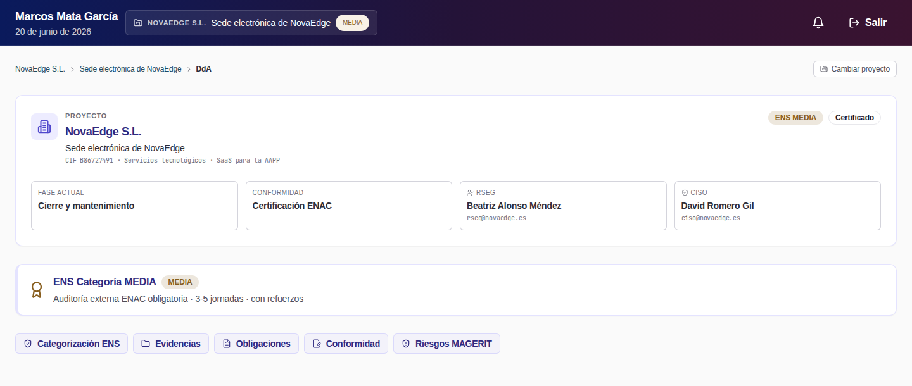
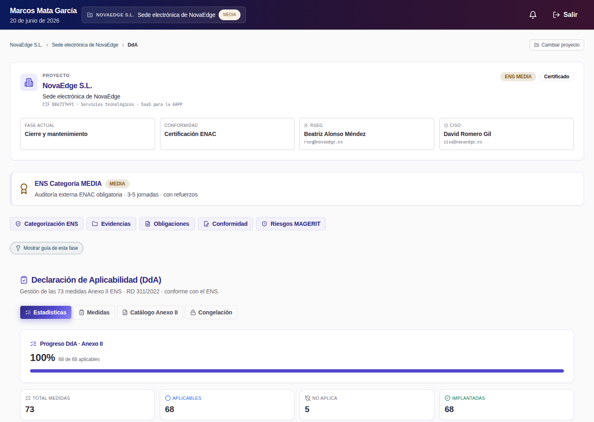
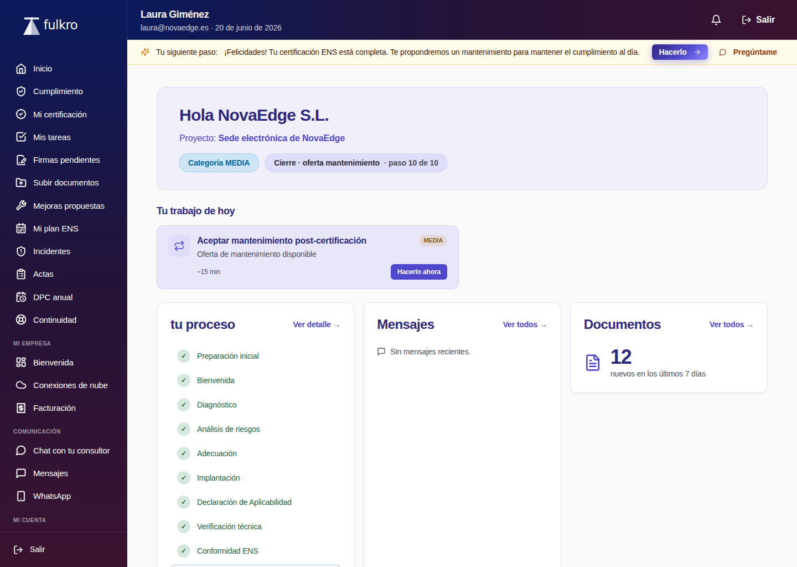
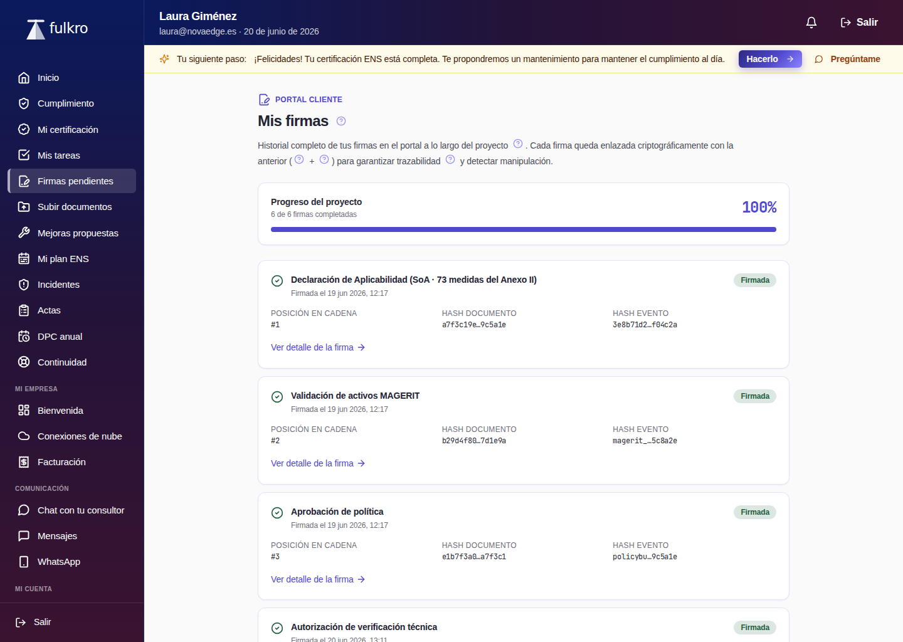
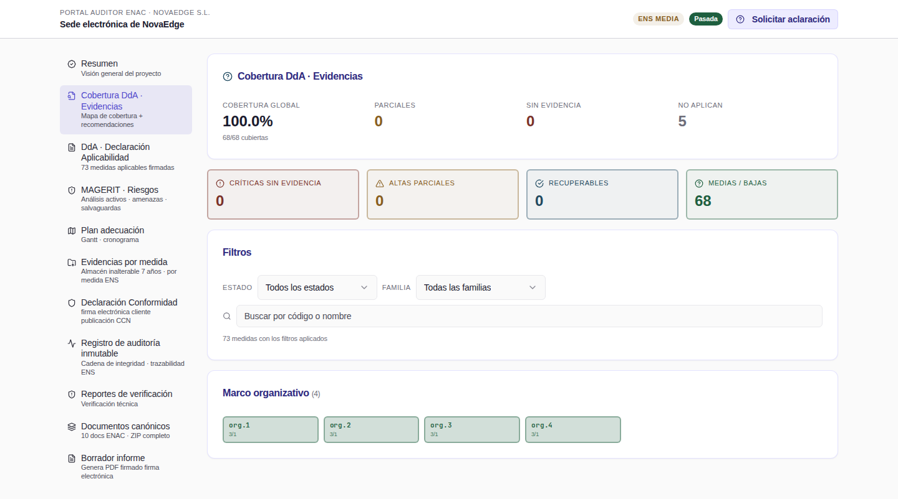
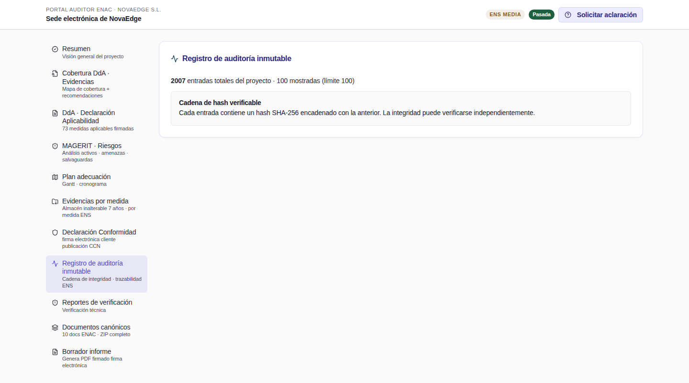
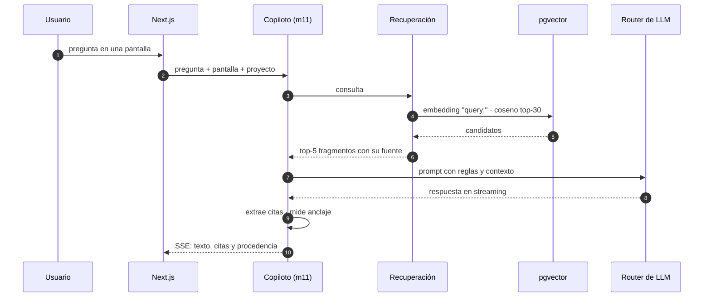

<div align="center">



<br><br>

[](LICENSE)
[](backend/pyproject.toml)
[](#métricas)
[](#los-cuatro-portales)
[](#arquitectura)
[](#evals-y-calidad)

**Español** · [English](README.en.md)

</div>

<br>

Fulkro es una plataforma para implantar el **Esquema Nacional de Seguridad** (ENS, Real Decreto
311/2022) en empresas que trabajan para la Administración pública. Cubre el ciclo entero, desde la
categorización del sistema hasta la declaración de conformidad que recibe la entidad certificadora,
y lo reparte en cuatro portales: el del consultor, el del cliente, el del auditor y el de
verificación pública. La construyó y la operó una sola persona. El proyecto se detuvo en septiembre
de 2026 por falta de tracción comercial, y el código se publica completo bajo Apache-2.0: se levanta
con un comando y con datos de demostración dentro.

<div align="center">

<br><sub>Recorrido real sobre el demo (<code>make demo</code>): administración, cliente y auditor. Los datos son ficticios.</sub>
</div>

## En un minuto

- **Qué resuelve.** El ENS exige a quien presta servicios a la Administración categorizar su
  sistema, analizar riesgos con MAGERIT, justificar cuáles de las 73 medidas del Anexo II aplican,
  implantarlas con evidencia y superar una auditoría. Fulkro convierte ese proceso en un flujo con
  puertas entre fases, documentos generados y evidencia verificable.
- **Cómo decide.** 44 motores de dominio en FastAPI. Toda decisión normativa (la categoría, qué
  medidas aplican, los plazos) la calcula un motor determinista y trazable, nunca un modelo de
  lenguaje.
- **Dónde entra la IA.** 12 agentes con salida estructurada y un copiloto con RAG sobre el corpus
  normativo. El modelo redacta; cada texto declara si lo escribió el modelo o una plantilla de
  reserva, y la interfaz lo enseña.
- **Por qué es fiable.** Aislamiento por cliente con RLS en 185 tablas, registro de auditoría con
  cadena de hashes inmutable, firma Ed25519 de documentos y evidencias, y almacenamiento WORM.
- **Cómo se sabe que funciona.** 6.884 tests en verde, 413 escenarios E2E, 97 páginas auditadas con
  axe (WCAG) y una evaluación de recuperación con intervalos de confianza que decidió la
  arquitectura del RAG.

<table>
<tr>
<td align="center" width="25%"><h3>44</h3><sub>motores de dominio</sub></td>
<td align="center" width="25%"><h3>1.203</h3><sub>operaciones de API</sub></td>
<td align="center" width="25%"><h3>12</h3><sub>agentes de IA activos</sub></td>
<td align="center" width="25%"><h3>123</h3><sub>plantillas documentales</sub></td>
</tr>
<tr>
<td align="center"><h3>0,959</h3><sub>acierto@5 del RAG</sub></td>
<td align="center"><h3>185</h3><sub>tablas con RLS</sub></td>
<td align="center"><h3>6.884</h3><sub>tests en verde</sub></td>
<td align="center"><h3>97</h3><sub>páginas WCAG sin fallos graves</sub></td>
</tr>
</table>

<details>
<summary><b>Índice</b></summary>

- [Qué hace Fulkro](#qué-hace-fulkro)
- [Arquitectura](#arquitectura)
- [El ciclo ENS](#el-ciclo-ens)
- [Los cuatro portales](#los-cuatro-portales)
- [La capa de IA](#la-capa-de-ia)
- [RAG: recuperación normativa](#rag-recuperación-normativa)
- [Evals y calidad](#evals-y-calidad)
- [Seguridad y confianza](#seguridad-y-confianza)
- [Decisiones de arquitectura](#decisiones-de-arquitectura)
- [Pruébalo](#pruébalo)
- [Métricas](#métricas)
- [Datos, licencias y estructura](#datos-licencias-y-estructura)

</details>

---

## Qué hace Fulkro

<table>
<tr>
<td width="33%" valign="top"><b>Ciclo ENS completo</b><br><sub>Categorización por las cinco dimensiones del Anexo I, análisis de riesgos MAGERIT v3, declaración de aplicabilidad de las 73 medidas, plan de adecuación con Gantt, implantación, simulacro de auditoría y declaración de conformidad.</sub></td>
<td width="33%" valign="top"><b>Motores deterministas</b><br><sub>Cada regla normativa vive en un solo motor, con tests que impiden que se duplique. Los dos ejes de aplicabilidad del Anexo II (categoría y nivel por dimensión) están extraídos del BOE y verificados contra él.</sub></td>
<td width="33%" valign="top"><b>Capa de IA</b><br><sub>12 agentes (diagnóstico, contratos, propuestas, auditor interno virtual, clasificación documental…) y un copiloto que explica cada pantalla y cita el RD 311/2022, con respuesta en streaming.</sub></td>
</tr>
<tr>
<td valign="top"><b>RAG normativo</b><br><sub>1.031 fragmentos del RD 311/2022 y de la legislación de la UE (RGPD, DORA, NIS2, eIDAS), embeddings e5-large de 1024 dimensiones en pgvector y una arquitectura de recuperación elegida por evaluación.</sub></td>
<td valign="top"><b>Fábrica documental</b><br><sub>123 plantillas (35 políticas, 36 procedimientos, 41 entregables, registros) que se rellenan con los datos del proyecto y salen en DOCX y PDF, versionadas y firmables.</sub></td>
<td valign="top"><b>Evidencia con custodia</b><br><sub>Cada evidencia pasa por antivirus, se sella con SHA-256 y firma Ed25519, y se guarda en un almacén WORM con retención de 7 años. El auditor ve la cobertura medida contra ella.</sub></td>
</tr>
<tr>
<td valign="top"><b>Firma electrónica</b><br><sub>Firma sobre lienzo (eIDAS art. 25.1) con sello Ed25519 y cadena de hashes por documento, paso de verificación por OTP y la firma incrustada en la última página del PDF.</sub></td>
<td valign="top"><b>Nube y verificación técnica</b><br><sub>Conectores de sólo lectura para Microsoft 365 y Google Workspace que detectan brechas, y 13 servidores MCP de verificación (nube, red, web, SAST…) tras un guardián de alcance.</sub></td>
<td valign="top"><b>Operación y cumplimiento propio</b><br><sub>Observabilidad del coste de cada llamada al modelo, monitor de cumplimiento que aplica el ENS Medio a la propia plataforma, copias cifradas y 20 tareas programadas.</sub></td>
</tr>
</table>

---

## Arquitectura

<div align="center">

</div>

**Principios que sostienen la forma:**

1. **Una regla normativa vive en un solo motor.** Cuando la misma regla existía en dos sitios,
   divergía. `backend/tests/audit_fixes/test_operaciones_normativas_un_solo_camino.py` lo impide.
2. **Los motores deciden, el modelo redacta.** Los documentos firmables los produce un motor: la
   justificación de la DdA sale de una plantilla determinista, y lo que propone un agente lo revisa
   el consultor.
3. **Una sola puerta.** `authenticate_request` es una dependencia global: pasan por ella las 1.204
   rutas de la aplicación, y después cada router exige su población (administrador o cliente).
4. **Aislamiento en la base, no en la aplicación.** El proceso corre con un rol sin superusuario y
   cada petición fija su contexto de cliente; las políticas RLS hacen el resto.
5. **Sin estado entre réplicas.** Sesiones, claves de firma y ficheros viven fuera del proceso;
   medido con dos réplicas detrás de nginx ([ADR-058](docs/adr/ADR-058-escalabilidad-horizontal.md)).

| capa | tecnología |
|---|---|
| Frontend | Next.js 15 (App Router), React, TypeScript, Tailwind, shadcn/ui, TanStack Query, Zustand |
| API | Python 3.12, FastAPI, SQLAlchemy 2 asíncrono, Pydantic, Alembic (273 migraciones) |
| Datos | PostgreSQL 16 con pgvector (HNSW) y RLS, MinIO con Object Lock, Redis |
| Trabajo asíncrono | Celery con 20 tareas programadas, difusión SSE con reenvío por `Last-Event-ID` |
| IA | SDK oficial de Anthropic tras un router propio, FastEmbed con `multilingual-e5-large` |
| Documentos | docxtpl, LibreOffice sin cabeza, ReportLab, firma Ed25519 |
| Calidad | pytest, Playwright, axe-core, ruff, mypy, bandit, safety, npm audit |
| Despliegue | Docker Compose (demo y producción), Caddy, imagen publicada en GHCR |

---

## El ciclo ENS

<div align="center">

</div>

El ENS no es una lista de comprobación: es un ciclo con dependencias. Cada fase consume lo que
produjo la anterior, y las puertas entre fases están en el código.

| # | fase | motor | produce | puerta hacia la siguiente |
|---|---|---|---|---|
| 1 | **Categorización** | m01 | acta **E-012** firmada | sin categoría aprobada no hay DdA |
| 2 | **Análisis de riesgos** | m02 | informe **E-028** (MAGERIT v3) | un solo análisis vigente, garantizado por la base |
| 3 | **Declaración de aplicabilidad** | m03 | 73 entradas del Anexo II | congelarla exige el 80 % valorado y la firma del responsable de seguridad |
| 4 | **Plan de adecuación** | m17 | **E-150** con hitos y dependencias | se deriva del análisis de brechas |
| 5 | **Implantación** | m07 | evidencias en almacén WORM | cada medida con evidencia vigente |
| 6 | **Verificación** | m10 · m09 | simulacro previo a la auditoría, firmado | cobertura medida, no declarada |
| 7 | **Conformidad** | m27 · m09 | expediente para el auditor y declaración **E-041** | la declaración dice lo verificado |

**Cómo se aplica la norma, con precisión.** La categoría es el **máximo** de las cinco dimensiones
(confidencialidad, integridad, disponibilidad, autenticidad y trazabilidad) valoradas sobre los
servicios y la información del sistema. Una dimensión que nadie valora no se adscribe a ningún
nivel, como dice el Anexo I ([ADR-061](docs/adr/ADR-061-el-eje-de-dimensiones-y-la-dimension-no-afectada.md)).
Una medida aplica por la **categoría** del sistema o por el **nivel de una dimensión**, los dos
ejes del Anexo II: 45 medidas por el primero y 28 por el segundo. Aplicables por categoría:
**BÁSICA 52 · MEDIA 68 · ALTA 73**.

---

## Los cuatro portales

<table>
<tr>
<td width="50%"></td>
<td width="50%"></td>
</tr>
<tr>
<td align="center"><b>Administración · centro de mando</b><br><sub>el estado de todos los proyectos a la vez</sub></td>
<td align="center"><b>Administración · declaración de aplicabilidad</b><br><sub>las 73 medidas del Anexo II, con sus dos ejes</sub></td>
</tr>
<tr>
<td width="50%"></td>
<td width="50%"></td>
</tr>
<tr>
<td align="center"><b>Cliente · inicio</b><br><sub>avance, tareas y documentos, sin jerga</sub></td>
<td align="center"><b>Cliente · firmas</b><br><sub>cada firma encadenada criptográficamente a la anterior</sub></td>
</tr>
<tr>
<td width="50%"></td>
<td width="50%"></td>
</tr>
<tr>
<td align="center"><b>Auditor · cobertura</b><br><sub>medidas declaradas frente a evidencia vigente</sub></td>
<td align="center"><b>Auditor · registro inmutable</b><br><sub>cadena de hashes verificable</sub></td>
</tr>
</table>

| portal | quién | cómo entra | qué hace |
|---|---|---|---|
| **Administración** | el consultor | contraseña y WebAuthn o TOTP | 95 páginas, casi todas bajo `/admin/projects/{id}/…`: 46 pestañas por proyecto ordenadas según el ciclo, centro de mando de todos los clientes y un copiloto que explica cada pantalla |
| **Cliente** | la empresa que implanta | correo, contraseña y MFA opcional | 41 páginas para **ver, autorizar, firmar y recibir**: avance, tareas, plan, documentos, firmas, certificación y chat con el consultor, con un tono vigilado por tests |
| **Auditor** | la entidad certificadora | enlace firmado Ed25519 y código de un solo uso, sin cuenta | expediente de sólo lectura: DdA, MAGERIT, plan, evidencias, registro de auditoría, mapa de cobertura, anotaciones y peticiones de aclaración que llegan al consultor en tiempo real |
| **Público** | cualquiera con un enlace | enlace firmado | descarga de documentos, cuestionario de diagnóstico previo, firma de terceros y verificación de firmas Ed25519 contra la clave pública del sistema |

Hay además un portal acotado para el **pentester externo**, al que se entra con un enlace firmado.

---

## La capa de IA

<div align="center">

</div>

**Los agentes.** Doce activos en el registro (`backend/app/agents/registry.py`), cada uno ligado al
motor que lo consume:

| agente | motor | gama | qué hace |
|---|---|---|---|
| A4 · Redactor de diagnósticos | m22 | Sonnet | redacta las secciones narrativas del diagnóstico E-090; los datos los calcula el motor |
| A6 · Analista de contratos | m14 | Sonnet | revisa los contratos del cliente con sus proveedores y detecta brechas de ENS y RGPD |
| A11 · Auditor interno virtual | m10 | Opus | añade criterio de auditor sénior al simulacro determinista de 58 preguntas |
| A12 · Coach del cliente | m09 | Sonnet | evalúa las respuestas del cliente a las preguntas del auditor |
| A14 · Copiloto | m11 | Sonnet | conversa sobre la pantalla actual con RAG y citas |
| A17 · Cualificador comercial | m13 | Sonnet | puntúa una oportunidad tras el primer contacto |
| A18 · Reunión exploratoria | m13 | Sonnet | recalcula en vivo las conclusiones de la reunión a partir de las notas |
| A19 · Redactor de propuestas | m13 | Opus | redacta la propuesta P-001 sobre la tarifa que calcula el motor |
| A20 · Negociador contractual | m14 | Sonnet | convierte la propuesta aprobada en el borrador de contrato C-001 |
| A21 · Detector de discrepancias | m04 | determinista | cruza lo declarado con lo verificado |
| A27 · Clasificador documental | m24 | Haiku | clasifica los documentos que la heurística determinista no sabe ubicar |
| A31 · Enriquecedor de la DdA | m03 | Sonnet | propone una justificación con el contexto del cliente para las medidas que no aplican |

**Salida estructurada y procedencia.** Once de los doce piden salida estructurada: JSON con un
esquema, que se valida y, si no cumple, se reintenta tres veces antes de servir una plantilla de
reserva. Cada resultado lleva la clave `generado_por` con tres valores posibles
(`backend/app/agents/procedencia.py`):

| `generado_por` | significado |
|---|---|
| `modelo` | lo redactó el modelo y cumplió el esquema |
| `plantilla_por_fallo_de_esquema` | el modelo contestó, pero su salida no cumplió el esquema |
| `sin_clave_de_api` | sin `ANTHROPIC_API_KEY`: no se llamó a ningún modelo |

La marca viaja hasta la pantalla, así que la plataforma arranca y funciona sin clave de API y
nunca presenta como redactado por el modelo un texto que no lo fue.

**El router de LLM** (`backend/app/core/ai/llm_router.py`) es la única puerta al modelo:

- **Reintentos ante 429**, tres, con espera exponencial de 2, 8 y 32 segundos; si el modelo pedido
  sigue saturado o da un 5xx, repite con el modelo de reserva. Un error de clave o una petición mal
  formada no se reintentan.
- **Caché de prompts**: el prompt de sistema viaja con `cache_control` efímero, así que las
  llamadas que lo repiten lo leen de la caché de Anthropic.
- **Catálogo de modelos**: sabe qué modelos admiten `temperature` y la fija siempre a 0,2 o menos.
- **Registro de cada llamada** con modelo, tokens y coste en `llm_interaction_log`, topes por
  superficie y una llamada fallida que nunca queda registrada como éxito
  ([ADR-059](docs/adr/ADR-059-llamada-llm-fallida-no-es-exito.md)).

**Salvaguardas.** Citas normativas obligatorias en toda respuesta, guardia contra inyección de
prompt (`backend/app/security/llm_prompt_injection_guard.py`), filtro de tono en lo que ve el
cliente y un modo «no está en el corpus» cuando la respuesta no se puede anclar.

---

## RAG: recuperación normativa

<div align="center">

</div>

**Ingesta.** Un parser determinista trocea el HTML consolidado del BOE por su estructura real
(preámbulo, 41 artículos, disposiciones y los cuatro anexos, con los 73 códigos de medida
exactos) y los textos oficiales de la UE. Salen 1.031 fragmentos: 127 del RD 311/2022 y 904 del
RGPD, DORA, NIS2 y eIDAS. Cada uno se vectoriza con `intfloat/multilingual-e5-large` (1024
dimensiones, prefijo `passage:`) y se indexa en pgvector con HNSW sobre coseno (`m=16`,
`ef_construction=64`).

**Recuperación.** La pregunta, con el contexto de la pantalla y el estado del proyecto, se
vectoriza con el prefijo `query:`; pgvector devuelve 30 candidatos por coseno y se quedan los 5
mejores (`backend/app/corpus/retrieval.py`).

**Generación y validación.** El copiloto responde con temperatura baja y con la obligación de citar
cada afirmación entre corchetes. Después se extraen las citas, se comprueba que al menos el 30 % de
la respuesta se apoya en los fragmentos recuperados y se detecta la respuesta «no está en el
corpus». La respuesta llega por streaming SSE, con las citas a medida que aparecen.


```mermaid
sequenceDiagram
    autonumber
    participant U as Usuario
    participant F as Next.js
    participant C as Copiloto (m11)
    participant R as Recuperación
    participant V as pgvector
    participant L as Router de LLM
    U->>F: pregunta en una pantalla
    F->>C: pregunta + pantalla + proyecto
    C->>R: consulta
    R->>V: embedding "query:" · coseno top-30
    V-->>R: candidatos
    R-->>C: top-5 fragmentos con su fuente
    C->>L: prompt con reglas y contexto
    L-->>C: respuesta en streaming
    C->>C: extrae citas · mide anclaje
    C-->>F: SSE: texto, citas y procedencia
```

**Evaluación: la arquitectura la eligió una medida.** 49 consultas de cumplimiento etiquetadas a
mano, con las cinco ramas medidas sobre las mismas consultas e intervalos por *bootstrap* de 10.000
remuestreos:

| rama | acierto@5 | recall@5 | MRR |
|---|---:|---:|---:|
| **vectorial sola** | **0,959** | **0,824** | **0,752** |
| fusión RRF (vectorial + léxica) | 0,857 | 0,667 | 0,627 |

| contraste pareado | diferencia | IC 95 % |
|---|---:|---|
| vectorial − fusión · acierto@5 | +0,102 | [+0,020, +0,204] |
| vectorial − fusión · recall@5 | +0,157 | [+0,065, +0,255] |
| vectorial − fusión · MRR | +0,125 | [+0,013, +0,246] |

Los tres intervalos excluyen el cero. La rama léxica no aportó ni uno de los 96 fragmentos
relevantes que el vector no trajera ya entre sus 30 primeros, y un barrido de su peso en la fusión,
de 0 a 1, da una curva cuyo máximo está en no fusionar. Por eso la recuperación en producción es
vectorial, y el arnés sigue midiendo las cinco ramas para volver a responder si el corpus cambia:

```bash
make eval-recuperacion     # escribe out/eval_recuperacion.json
```

Metodología completa en [`docs/EVAL_RECUPERACION.md`](docs/EVAL_RECUPERACION.md).

---

## Evals y calidad

| qué se mide | resultado | dónde |
|---|---|---|
| Suite de backend | **6.884 pasan · 0 fallan** (3.563 sin base + 3.321 con base) | `pytest`, y `pytest-completo.yml` en GitHub |
| Escenarios E2E | **413 / 413** | Playwright contra la aplicación real |
| Accesibilidad | **97 / 97** páginas sin fallos críticos ni graves | axe-core en los tres portales, en cada push |
| Recuperación del RAG | acierto@5 **0,959** · recall@5 **0,824** · MRR **0,752** | `make eval-recuperacion` |
| Agentes contra el modelo real | **22 / 22** de punta a punta, uno por agente y motor | tests opt-in con `ANTHROPIC_API_KEY` |
| Conjuntos dorados de agentes | 4 conjuntos, 40 entradas, validados en cada PR | `evals.yml` · job `evals-arnes` |
| Carga | lecturas a **200-450 pet./s** por réplica, **1,7-1,9×** con dos | [`docs/PRUEBA_DE_CARGA.md`](docs/PRUEBA_DE_CARGA.md) |
| Demo | **22 / 22** comprobaciones sobre datos reales | `make smoke` |

**Integración continua**, seis workflows:

| workflow | qué comprueba |
|---|---|
| `ci.yml` | ruff, mypy, tipos del frontend, la suite sin base y el arnés de evaluación |
| `pytest-completo.yml` | la suite con base de datos, en cuatro trozos, contra PostgreSQL sembrado y MinIO |
| `admin-polish-empirical.yml` | axe (WCAG 2.2 AA) sobre 97 páginas de administración, cliente y auditor |
| `evals.yml` | los conjuntos dorados, y su ejecución contra el modelo cuando hay clave |
| `security-scan.yml` | bandit, safety y npm audit |
| `publish-image.yml` | construye y publica la imagen en GHCR |

**Guardas que protegen el repositorio en cada PR:** las cifras del README se reproducen con su
comando, ningún `fetch` que escribe va sin token CSRF, cada enlace de interfaz del backend lleva a
una página real, cada cita a una ruta del repositorio existe, ninguna regla normativa se duplica y
el catálogo ENS no repite texto de terceros (comparado contra una huella SHA-256, sin guardar el
texto).

---

## Seguridad y confianza

<div align="center">

</div>

- **Identidad.** El consultor entra con contraseña y WebAuthn (llave física) o TOTP; el cliente,
  con MFA propio; el auditor y los firmantes externos, con enlaces firmados Ed25519 que caducan y
  piden un código de un solo uso. Hay 37 propósitos de enlace distintos, cada uno con su política.
- **Sesión.** JWT firmado con Ed25519 en cookie `httpOnly`, con verificación CSRF de triple enlace en
  toda petición que escribe.
- **Aislamiento.** RLS en 185 de las 253 tablas, 192 políticas, y un rol de aplicación sin
  superusuario: una consulta sin contexto de cliente no ve nada.
- **Integridad.** El registro de auditoría encadena cada fila con SHA-256 mediante un disparador de
  PostgreSQL, y otros dos impiden `UPDATE` y `DELETE`. La cadena se verifica desde el portal del
  auditor.
- **Custodia.** Antivirus, SHA-256 y firma Ed25519 en cada evidencia, y un bucket de MinIO con
  Object Lock en modo COMPLIANCE durante 7 años.
- **Operación.** Copias cifradas con Fernet, un monitor que aplica el ENS Medio a la propia
  plataforma y la gestión de derechos y brechas del RGPD integrada.

---

## Decisiones de arquitectura

| decisión | por qué | dónde |
|---|---|---|
| Motores deterministas para toda decisión normativa | una decisión normativa tiene que poder reproducirse y explicarse ante un auditor | `backend/app/motors/` |
| Una regla normativa, un solo motor | dos copias de una regla acaban divergiendo | `test_operaciones_normativas_un_solo_camino.py` |
| Procedencia explícita del texto generado | nadie debe confundir una plantilla con una redacción del modelo | [ADR-059](docs/adr/ADR-059-llamada-llm-fallida-no-es-exito.md) |
| Recuperación vectorial sola | medida contra la fusión: gana en las tres métricas | [`EVAL_RECUPERACION.md`](docs/EVAL_RECUPERACION.md) |
| Aislamiento por RLS en PostgreSQL | el aislamiento no depende de que cada consulta recuerde filtrar | `infra/docker/init-roles.sql` |
| Un operador y varios clientes | identidad simple a cambio de profundidad normativa | `backend/app/auth/dependencies.py` |
| Administración centrada en el proyecto | el consultor trabaja un cliente cada vez, con contexto persistente | [ADR-054](docs/architecture/ADR-054_project_scoped_admin_ux.md) |
| Conectores de nube de sólo lectura | detectar brechas sin poder romper nada en la cuenta del cliente | [ADR-053](docs/architecture/ADR-053_cloud_first_architecture.md) |
| Remediación por niveles de riesgo | lo inocuo se automatiza; lo arriesgado exige autorización | [ADR-055](docs/architecture/ADR-055-auto-remediation.md) |
| Procesos sin estado | escalar es añadir réplicas; medido con dos | [ADR-058](docs/adr/ADR-058-escalabilidad-horizontal.md) |
| Workers según la memoria del modelo de embeddings | el límite real es la RAM del modelo, no la CPU | [ADR-060](docs/adr/ADR-060-el-modelo-en-el-proceso-limita-los-workers.md) |
| Imagen de backend partida en dos | la aplicación no carga con el instrumental de pentest | [ADR-057](docs/adr/ADR-057-imagen-backend-sin-instrumental-pentest.md) |

El índice completo está en [`docs/adr/README.md`](docs/adr/README.md) y el mapa de piezas en
[`ARCHITECTURE.md`](ARCHITECTURE.md).

---

## Pruébalo

Un solo comando, sin ninguna clave de API:

```bash
git clone https://github.com/Fulkrodev/Fulkrosys.git
cd Fulkrosys
make demo
```

Deja la aplicación en `http://localhost:3000` con datos dentro (73 medidas del Anexo II, 73
entradas de DdA, 209 evidencias, 35 tareas de plan, 21 documentos y 1.031 fragmentos de corpus) e
imprime las credenciales de los tres portales, incluido el código del segundo factor y el enlace
firmado del auditor.

```bash
make smoke     # entra de verdad en los tres portales y contrasta los datos
make down      # para, conservando la base
make clean     # borra también los volúmenes
```

Requisitos, tiempos medidos y problemas frecuentes en [`INSTALL.md`](INSTALL.md); un recorrido
guiado por las pantallas en [`USAGE.md`](USAGE.md). `docker-compose.yml` declara 23 servicios para
desarrollo, 15 de ellos de verificación técnica en su propio perfil; el demo sólo necesita cinco.

El recorrido del principio se regenera sobre el demo con
`frontend/tests/capturas/grabar-recorrido.mjs` y `scripts/recorrido_a_gif.sh`, y los diagramas con
`scripts/generar_diagramas_readme.py`.

---

## Métricas

Cada cifra lleva el comando que la reproduce, y `backend/tests/test_las_cifras_del_readme_reproducen.py`
comprueba en cada PR que siguen coincidiendo.

| | | comando |
|---|---:|---|
| Operaciones de API | **1.203** en 1.100 caminos | `app.openapi()` · abajo |
| Motores de dominio | **44** | `ls -d backend/app/motors/m*/ \| wc -l` |
| Tablas en PostgreSQL | **253** | `psql -c "\\dt" \| wc -l` |
| Migraciones Alembic | **273** | `ls backend/migrations/versions/*.py \| wc -l` |
| Páginas del frontend | **167** | `find frontend/app -name page.tsx \| wc -l` |
| Componentes React | **424** | `find frontend/components -name '*.tsx' \| wc -l` |
| Líneas de Python | **244.277** | `find backend/app -name '*.py' \| xargs wc -l` |
| Ficheros de test | **640** | `find backend/tests -name 'test_*.py' \| wc -l` |
| Specs de Playwright | **300** | `find frontend/tests -name '*.spec.ts' \| wc -l` |

<details>
<summary><b>Las cifras, cada una con su comando</b></summary>

```bash
$ git ls-files backend/app | grep '\.py$' | xargs wc -l | tail -1
 244277 total

$ ls -d backend/app/motors/m*/ | wc -l
44

$ ls backend/migrations/versions/*.py | wc -l
273

# con el entorno del backend: la superficie de la API es su esquema OpenAPI
$ python3 -c "from backend.app.main import app; e=app.openapi(); \
M={'get','post','put','patch','delete','head','options','trace'}; \
print(len(e['paths']),'caminos ·', sum(1 for v in e['paths'].values() for m in v if m in M),'operaciones')"
1100 caminos · 1203 operaciones

$ ls backend/app/agents | grep -oE '^agent_[0-9]+' | sort -u | wc -l
13
$ python -c "from backend.app.agents.registry import AGENT_REGISTRY as R; print(sum(v['status'] == 'activo' for v in R.values()))"
12
$ grep -n '^_RATE_LIMIT_BACKOFFS' backend/app/core/ai/llm_router.py
107:_RATE_LIMIT_BACKOFFS: tuple[float, ...] = (2.0, 8.0, 32.0)
```

</details>

---

## Datos, licencias y estructura

El **código** está bajo [Apache-2.0](LICENSE). El corpus que se distribuye con los tests
(`backend/tests/fixtures/corpus_seed.sql.gz`) contiene sólo fuentes de libre redistribución: el RD
311/2022 (texto del BOE) y legislación de la Unión Europea. Las guías del CCN y de la AEPD no se
versionan: las ingiere el pipeline en local. El catálogo de medidas está redactado con lenguaje
propio y cada medida conserva la referencia a su fuente oficial.

| fuente del corpus | qué es |
|---|---|
| `RD_311_2022` | norma oficial, BOE-A-2022-7191 |
| `UE-RGPD`, `UE-DORA`, `UE-NIS2`, `UE-EIDAS` | norma oficial de la Unión Europea |
| Guías `CCN-STIC-800…814` | guías del CCN, descargadas por el operador |
| `FULKRO_RESUMEN_CONFORMIDAD_ENS` | resumen propio, etiquetado como tal para que la recuperación lo distinga de la norma |

Terceros con atribución: **shadcn/ui** (MIT), **MITRE ATT&CK** y **MAGERIT v3.0** (MINHAP).

```
backend/          FastAPI · 44 directorios de motor en app/motors/ · 273 migraciones
frontend/         Next.js 15 · App Router · 5 grupos de ruta:
                  (admin) (client-portal) (legal) (portal) (public)
docs/             catálogos que lee el arranque (MAGERIT, ENS, plantillas), ADR y evaluaciones
infra/docker/     init SQL de extensiones, funciones RLS y roles · Dockerfiles
scripts/          operación, medición y generación de los diagramas y el recorrido
landing/          sitio estático del proyecto (fulkro.es)
```
