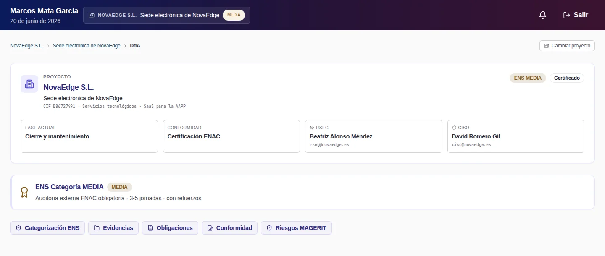
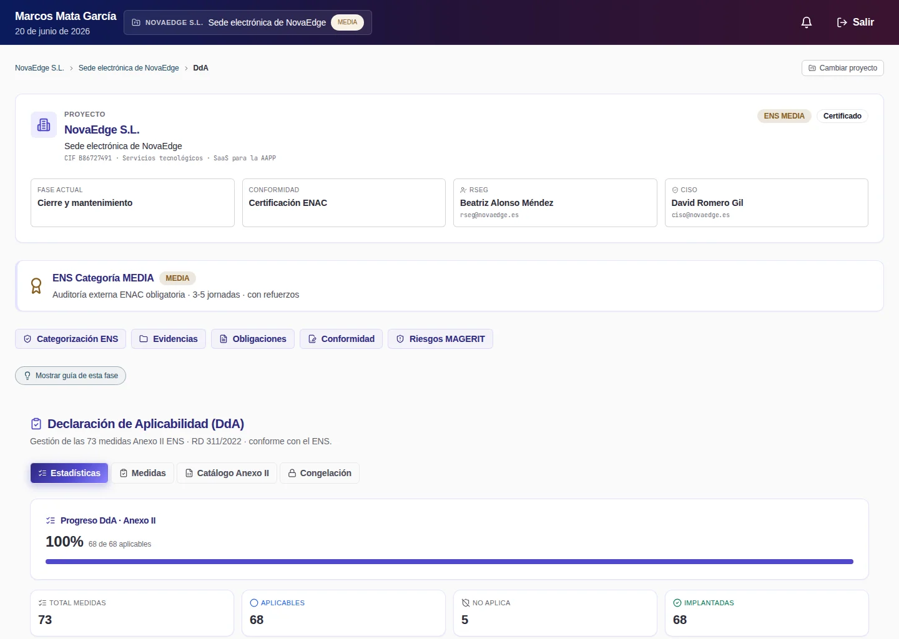
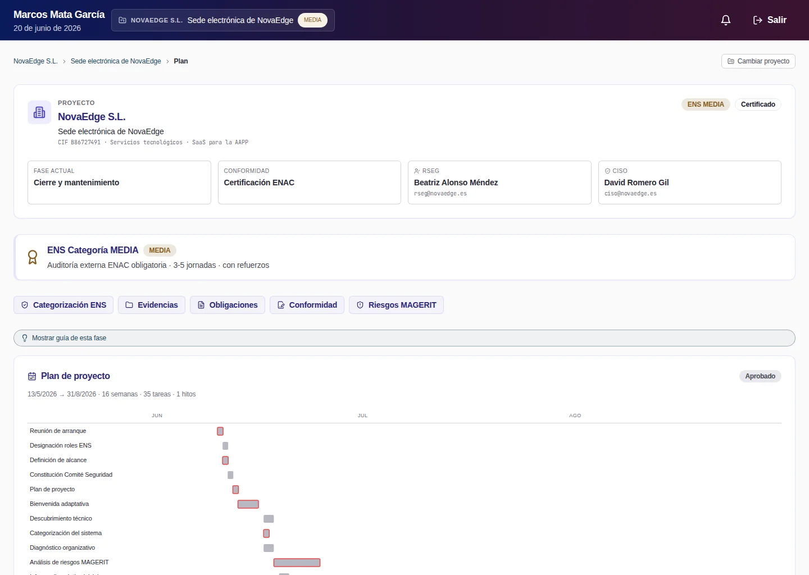
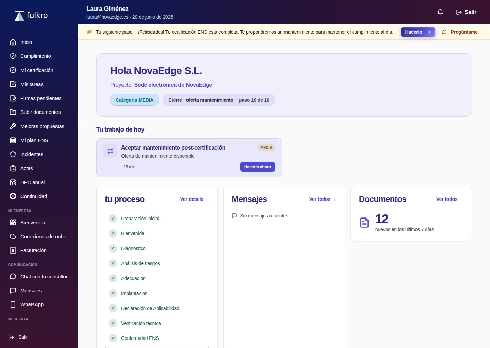
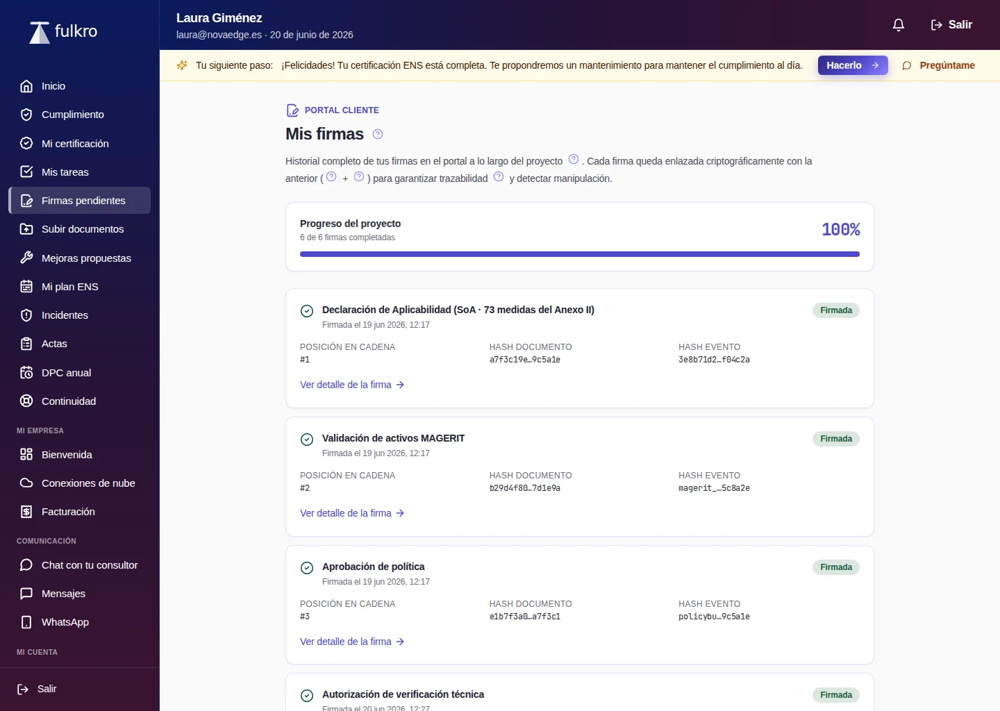
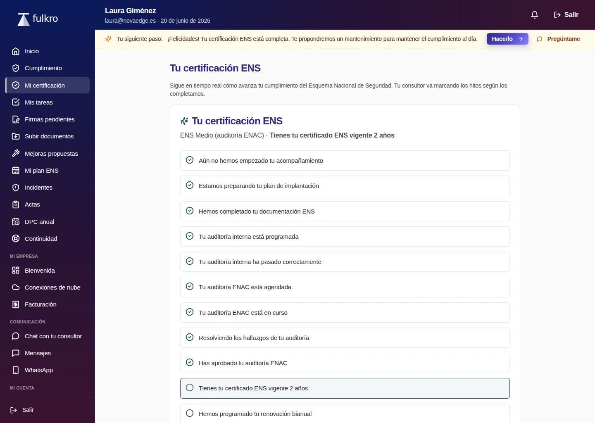
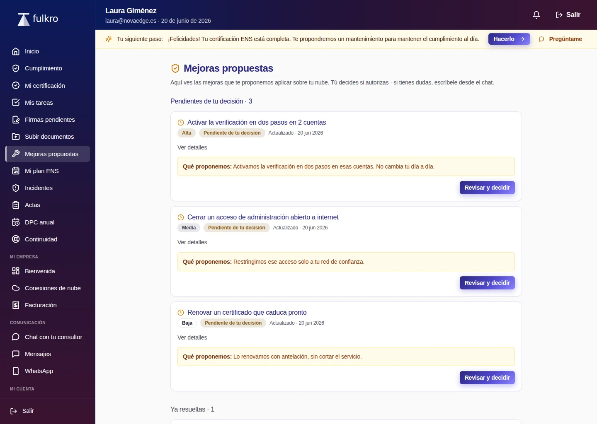
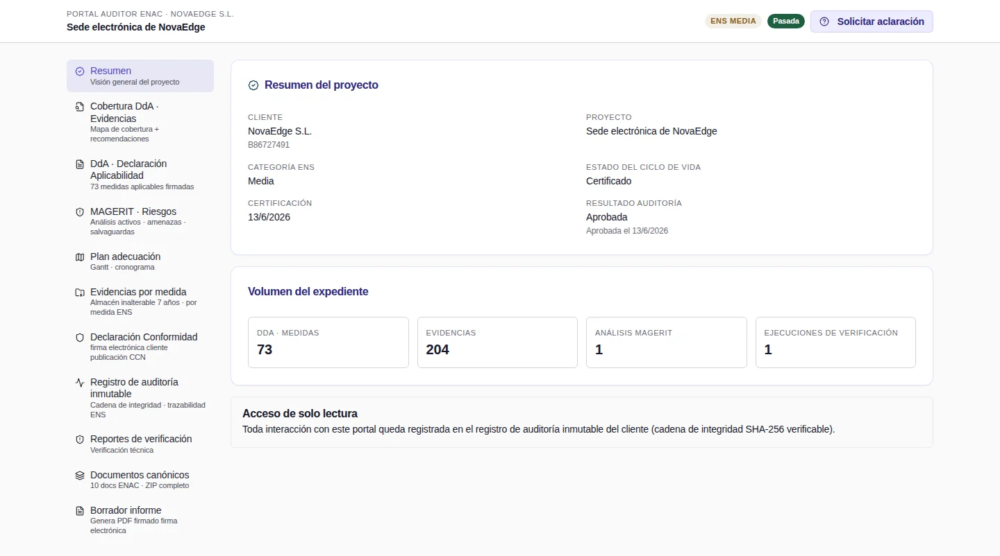
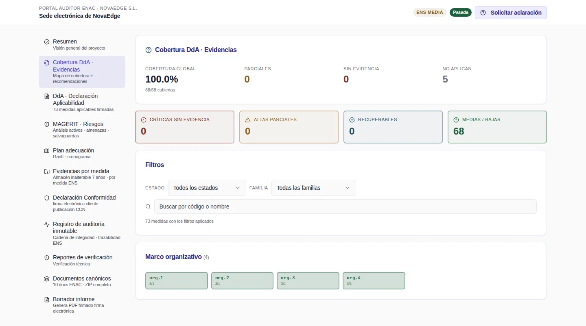
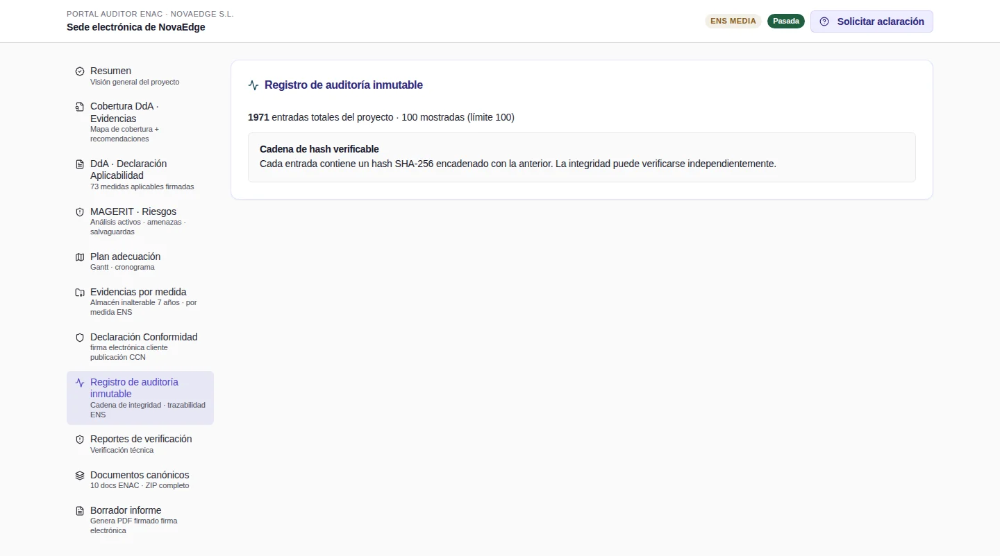

# Recorrido guiado · diez minutos

Esto es lo que hay que mirar, en qué orden y qué se espera ver en cada pantalla.
No hace falta saber nada del ENS para seguirlo: cada paso explica qué es lo que
está mirando.

Si aún no lo tienes levantado, [INSTALL.md](INSTALL.md) lo deja funcionando con
dos órdenes. Cuando termine, la propia orden imprime las credenciales.

> **El demo es para evaluación en tu máquina.** Trae contraseñas conocidas y no
> está pensado para exponerlo a internet. Ver INSTALL.md.

---

## Antes de empezar · dónde está cada cosa

| | |
|---|---|
| Aplicación | http://localhost:3000 |
| API y su documentación | http://127.0.0.1:18000/docs |
| Operador (Marcos) | `demo@fulkro.es` / `fulkro-demo-2026` + código de 6 dígitos |
| Cliente | `cliente@fulkro.es` / `fulkro-demo-2026` |
| Auditor | enlace firmado de un solo uso + código, ambos impresos por `make demo` |

El código de 6 dígitos del operador **cambia cada 30 segundos**. `make demo`
imprime uno válido y también el secreto (`Secreto TOTP`), por si prefieres
meterlo en tu aplicación de autenticación. Si se te pasó el tiempo, vuelve a
lanzar `make demo`: es idempotente y no resiembra nada.

**Qué es lo que vas a ver.** Una consultoría de implantación del Esquema
Nacional de Seguridad (RD 311/2022) con **tres portales distintos** sobre los
mismos datos:

- **el operador** (el consultor) lleva los proyectos,
- **el cliente** ve su avance, autoriza y firma, sin tocar nada técnico,
- **el auditor** entra por un enlace firmado, en sólo lectura, a revisar el
  expediente antes de una certificación.

Eso es lo que se recorre a continuación.

---

## 1 · Entrar como operador  ·  1 minuto

Abre **http://localhost:3000/login**, mete `demo@fulkro.es` /
`fulkro-demo-2026`, y después el código de 6 dígitos.



**Lo que se espera ver.** El selector de proyectos con cuatro clientes. Arranca
también un tour de 6 pasos; puedes seguirlo o darle a *Saltar*.

De los cuatro clientes, **el único con datos es `NovaEdge S.L.`**. Los otros
tres (`MicroServicios del Sur`, `DataForma Galicia`, `InfraCrítica Iberia`)
existen para que se vea el listado y las tres categorías del ENS —Básica, Media
y Alta—, pero sus proyectos están **vacíos a propósito**. Si entras en uno de
ellos verás pantallas sin contenido, y no es un fallo.

Pulsa **Entrar al proyecto** en `NovaEdge S.L.`

> El acceso lleva segundo factor obligatorio y cada entrada queda anotada en el
> registro de auditoría. Es la misma plataforma cumpliendo por dentro lo que
> vende: el ENS exige ambas cosas.

---

## 2 · Dar de alta un cliente  ·  1 minuto

Vuelve a **Proyectos** (arriba) y pulsa **Alta de cliente nuevo**.

> Ojo, hay dos botones y hacen cosas distintas. **Alta de cliente nuevo** es el
> asistente completo, para una empresa que todavía no está dada de alta.
> **Nuevo proyecto** abre un formulario corto para añadir otro proyecto a un
> cliente que **ya existe**. Si quieres ir directo: `/admin/projects/new`.

**Lo que se espera ver.** Un asistente de **6 pasos**: datos del cliente,
contexto ENS, categoría preliminar, activos críticos, primer usuario del portal
y revisión final. Basta con leer los pasos; no hace falta completarlo.

Lo que importa entender: no se crea "un cliente" a secas. En una sola operación
se crean **cliente + proyecto + análisis de riesgos inicial + sistema de
información + departamentos sugeridos + primer usuario del portal**, y todo o
nada: si algo falla, no queda medio cliente a medias.

El **paso 3** es donde se decide la categoría. En el ENS la categoría (Básica,
Media o Alta) determina cuántas medidas de seguridad son obligatorias, y de ahí
sale todo lo demás. Por eso se pregunta tan pronto.

Si lo completas, aparecerá un quinto cliente. Para el resto del recorrido vuelve
a `NovaEdge S.L.`

---

## 3 · La evaluación ENS: la Declaración de Aplicabilidad  ·  2 minutos

Dentro del proyecto, en la barra lateral: **DdA**.



**Lo que se espera ver.** Arriba, cinco contadores:

```
TOTAL MEDIDAS 73 · APLICABLES 68 · NO APLICA 5 · IMPLANTADAS 68 · PARCIAL 0
```

**Qué es esto.** El Anexo II del RD 311/2022 es un catálogo de medidas de
seguridad. Para una categoría **Media** salen **73 medidas** en juego, de las
que **68 aplican** a este sistema y **5 no**. La *Declaración de Aplicabilidad*
es el documento que dice, medida por medida, si aplica y por qué — y es lo
primero que pide un auditor.

Aquí no hay nada que un modelo de lenguaje haya decidido: la aplicabilidad sale
del catálogo normativo y de la categoría del proyecto. Es determinista y
reproducible, que es lo que exige la trazabilidad de una certificación.

Abre la pestaña **Medidas** y mira una cualquiera. Cada una trae su código
(`op.acc.5`, `mp.com.2`…), qué exige, su estado, y las **dimensiones** a las que
afecta. Los códigos son los oficiales: `org` es marco organizativo, `op` marco
operacional y `mp` medidas de protección.

---

## 4 · La cobertura: qué falta para certificar  ·  2 minutos

En la barra lateral: **Conformidad**.

**Lo que se espera ver.** El camino a la conformidad en **6 pasos**, del uno al
seis, con un botón *Ir* en cada uno:

1. DdA final firmada
2. Plan de adecuación implementado
3. Auditor externo ENAC asignado
4. Auditoría externa ejecutada
5. Distintivo y certificado de conformidad
6. Reporte INES anual

Debajo, el **Distintivo de Conformidad ENS** ya generado, con su identificador,
y tres botones: *Descargar Declaración (DOCX)*, *Descargar SVG* y *Copiar
snippet HTML*. Ese distintivo es el sello que una empresa certificada pone en su
web; el SVG y el snippet son exactamente para eso.

Verás también un aviso de **Verificación cloud** diciendo que todas las medidas
se verifican por documento porque no hay ningún proveedor conectado. Es cierto:
la plataforma puede conectarse en sólo lectura a Microsoft 365, Google
Workspace, AWS o Azure y comprobar automáticamente parte de las medidas, pero el
demo no conecta nada a ninguna nube.

---

## 5 · Generar un entregable  ·  2 minutos

En la barra lateral: **Plan**.



**Lo que se espera ver.** Un cronograma de **16 semanas y 35 tareas**, desde
`WBS-001 Reunión de arranque` hasta `WBS-081 Vigilancia continua`, agrupadas por
fases. Y abajo, un botón: **Generar Plan Adecuación (DOCX)**.

Púlsalo. Se descarga un `.docx` real. Ese es el documento maestro que pide la
guía CCN-STIC 806: reúne la categorización, el análisis de riesgos, la
Declaración de Aplicabilidad, los huecos detectados y el plan de acciones
correctivas.

Ahora mira **Documentos (IDMS)** en la barra lateral. Son **21 documentos** del
proyecto, con su código normativo, su clasificación, su estado y su tamaño:
`E-049` (el distintivo), `E-049-EXT` (el certificado de la entidad acreditada),
`E-040` (el acta de arranque) y dieciocho políticas.

La diferencia entre esta pantalla y una carpeta compartida es que cada documento
tiene código, versión, estado y trazabilidad hasta la medida del ENS que
justifica su existencia.

---

## 6 · La evidencia firmada  ·  2 minutos

En la barra lateral: **Evidencias**.

**Lo que se espera ver.** El *Evidence Vault* con **209/209** y, arriba, el
formulario **Subir evidencia (admin)** con dos desplegables: 12 tipos de
evidencia (política firmada, acta de comité, captura de configuración MFA,
exportación de inventario…) y las 68 medidas aplicables.

**Cinco de esas 209 son evidencias de verdad.** Búscalas por nombre de fichero:

| fichero | medida | tipo |
|---|---|---|
| `politica-seguridad-novaedge-v1.pdf` | `org.1` | Política firmada |
| `acta-comite-seguridad-2026-03.pdf` | `org.2` | Acta de comité de seguridad |
| `mfa-obligatorio-entra-id.png` | `op.acc.5` | Captura de configuración IDP/MFA |
| `inventario-activos-2026Q1.csv` | `mp.info.1` | Exportación de inventario |
| `prueba-restauracion-backup-2026-02.pdf` | `op.cont.1` | Prueba de restauración |

Cada una tiene fichero, su hash SHA-256 y una **firma Ed25519** de 128
caracteres. Al subir una evidencia se calcula el hash del contenido y se firma:
si alguien altera el fichero después, la firma deja de cuadrar. Eso es lo que
convierte un PDF en una prueba defendible ante un auditor.

**Las otras 204 son relleno del sembrado**: filas sin fichero, sin nombre y sin
firma, que existen para que los contadores y los cruces por medida no salgan a
cero. En la tabla aparecen como *(sin nombre) · Pendiente firma*. No es un
fallo; es que el demo no incluye 204 documentos reales.

Prueba a subir una tú: elige *Política firmada*, la medida `org.3` y cualquier
PDF. El aviso de confirmación dice literalmente **"subida y firmada (Ed25519)"**.

---

## 7 · Los otros dos portales  ·  2 minutos

Hasta aquí has visto lo que ve el consultor. Los mismos datos se ven muy
distintos desde los otros dos lados.

### El cliente

Ventana de incógnito → **http://localhost:3000/client-portal/login** →
`cliente@fulkro.es` / `fulkro-demo-2026`.



**Lo que se espera ver.** *"Hola NovaEdge S.L."*, su proyecto, su categoría, y
un recorrido de **10 pasos** en lenguaje llano: Preparación inicial, Onboarding,
Diagnóstico, Análisis de riesgos, Adecuación, Implantación, Declaración de
Aplicabilidad, Verificación técnica, Conformidad ENS, Cierre.

Fíjate en lo que **no** hay: ni códigos de medida, ni nombres de motores, ni
jerga. El cliente ve, autoriza, firma y recibe. No opera la implantación técnica
— ésa es la doctrina de producto, no una limitación.

Merece la pena mirar tres pantallas más de la barra lateral:

| ruta | qué es |
|---|---|
| `/client-portal/firmas-pendientes` | firma con el dedo o el ratón; queda con firma Ed25519 y sello de tiempo |
| `/client-portal/certificacion` | en qué punto del camino a la certificación está |
| `/client-portal/conformidad` | su conformidad y sus documentos |





### El auditor

`make demo` imprime un enlace largo y un **código OTP**. Ábrelo en otra ventana
de incógnito e introduce el código.



**Lo que se espera ver.** El volumen del expediente —**73 medidas de DdA, 209
evidencias, 1 análisis MAGERIT**— y un aviso de que el acceso es de sólo lectura
y queda registrado.

En la barra lateral hay **11 secciones**. Merece la pena mirar tres:

**Cobertura DdA · Evidencias** — un mapa de calor de qué medidas tienen prueba
y cuáles no. Es lo primero que mira un auditor.



**Audit log inmutable** — el registro de todo lo que ha pasado en el proyecto,
con **cadena de hash SHA-256**: cada entrada encadena con la anterior, de modo
que borrar o modificar una rompe la cadena y se nota. Se puede verificar por
separado y exportar a CSV. Ahí aparecerá tu propia entrada al portal.



**Documentos canónicos** — el ZIP del expediente **firmado con Ed25519**. El
manifiesto lleva la firma dentro, así que el auditor puede comprobar sin
conexión que lo que le han entregado es lo que se generó.

> Te pedirá el código **cada vez que cambies de sección**. Es el mismo código; no
> caduca al usarlo.

---

## Qué acabas de ver, en una frase

Una plataforma que lleva a una empresa desde "quiero certificarme en el ENS"
hasta el expediente que se le entrega a un auditor acreditado: decide qué
medidas aplican según la norma, planifica el trabajo, genera los documentos,
recoge las pruebas firmadas de que cada medida está puesta, y se lo enseña a las
tres partes —consultor, cliente y auditor— en el lenguaje de cada una, dejando
rastro verificable de todo.

## Qué es real y qué no, en este demo

Se dice aquí para que nadie lo descubra por sorpresa:

- **Real**: las 73 medidas del Anexo II y su aplicabilidad, el catálogo de
  amenazas y salvaguardas MAGERIT, los documentos generados (se descargan y se
  abren), las 5 evidencias firmadas, la cadena de hash del registro de
  auditoría, los tres portales, el segundo factor y la firma Ed25519.
- **Relleno**: 204 de las 209 evidencias son filas sin fichero. Tres de los
  cuatro clientes tienen el proyecto vacío. Los datos del cliente `NovaEdge
  S.L.` son ficticios.
- **No disponible sin clave de API**: todo lo que dependa de un modelo de
  lenguaje (sugerencias del copiloto, redacción asistida, análisis de pliegos).
  Sin `ANTHROPIC_API_KEY` esas funciones **no se ejecutan y no se muestran**: no
  verás un texto inventado en su lugar.
- **No conectado**: ninguna nube. La verificación automática contra Microsoft
  365, Google Workspace, AWS o Azure existe, pero el demo no conecta nada.

## Si algo no cuadra

- **Pantallas vacías**: comprueba que estás en `NovaEdge S.L.` y no en uno de
  los otros tres clientes.
- **Comprobar que hay datos de verdad**: `make smoke`. Entra en los tres
  portales y contrasta los recuentos contra sus umbrales. Con la base vacía
  falla; ése es su criterio de aceptación.
- **Empezar de cero**: `make clean && make demo` (borra la base de datos y
  vuelve a sembrar; unos 2-3 minutos).
- **Lo demás**: la sección de problemas de [INSTALL.md](INSTALL.md).
